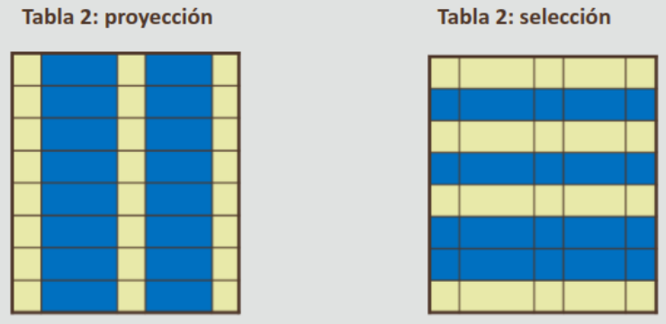
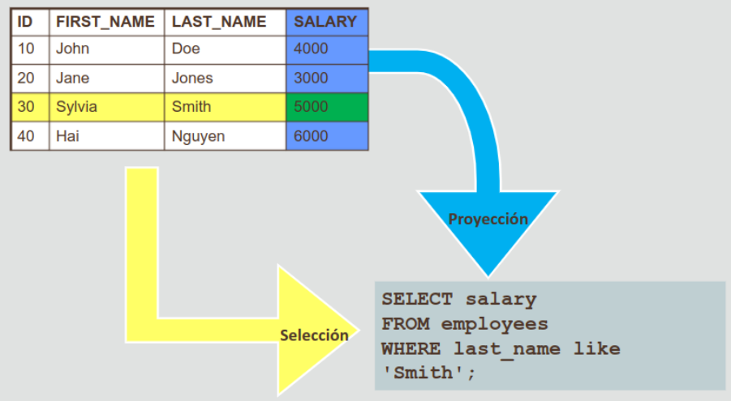

---
[//]: # "Esta es una forma bien estrafalaria de hacer comentarios en Markdown,
de acuerdo con la especificación CommonMark en la que se basa Github. ¿Qué
tiene esto de importante? ¿Por qué no usar comentarios HTML normales? pues esta
forma garantiza que no se renderizan en el documento final, lo cual es
conveniente. Más información en https://stackoverflow.com/a/20885980.
NOTA: Aunque se pueden usar saltos de línea, NO se puede
dejar líneas en blanco, siempre hay que llenarlas con algo, cualquier caracter sirve.
..
Prueba.
"

Oracle Academy: Database Programing with SQL, Parte 1

* [Volver al inicio](index.html)

- [1.1: Oracle Application Express](#11-oracle-application-express)
  - [Software de Aplicación vs Software de Sistema](#software-de-aplicación-vs-software-de-sistema)
  - [Uso de Aplicaciones](#uso-de-aplicaciones)
  - [Oracle Application Express](#oracle-application-express)
  - [Sentencia SELECT](#sentencia-select)
- [1.2 Tecnología de Bases de Datos Relacional](#12-tecnología-de-bases-de-datos-relacional)
  - [Revisión de Términos Clave](#revisión-de-términos-clave)
  - [Propiedades de las tablas](#propiedades-de-las-tablas)
  - [Acceso a los datos en un RDBMS](#acceso-a-los-datos-en-un-rdbms)
  - [Categorías de Sentencias SQL](#categorías-de-sentencias-sql)
- [Anatomía de una sentencia SQL](#anatomía-de-una-sentencia-sql)
  - [Palabra clave SELECT](#palabra-clave-select)
  - [Operadores aritméticos](#operadores-aritméticos)
  - [Valores NULL](#valores-null)
  - [Alias](#alias)

## 1.1: Oracle Application Express

### Software de Aplicación vs Software de Sistema

Las aplicaciones informáticas son algo con lo que se hace contacto rutinariamente (por ejemplo, un servicio de correo electrónico, el escáner de una tienda de abarrotes).

Con el desarrollo de los programas de aplicación, las computadores se convirtieron en una herramienta útil para la informática empresarial.

Los programas de aplicación permiten a cualquier persona adquirir software listo para usar, sin necesidad de entender cómo funciona el programa; sólo lo que hace y qué se quiere que haga.

El software de sistema consta de programas de bajo nivel diseñados para interactuar estrechamente con el hardware, como los compiladores y el sistema operativo. Por otra parte, el software de aplicación intenta cubrir necesidades afines al interés del usuario final, como el procesamiento de texto, juegos, correo electrónico y gráficos.

Con un software de aplicación, en lugar de requerir que los usuarios aprendan un lenguaje para comunicarse con una BBDD cuando necesiten recuperar información, este lenguaje se contiene dentro de la aplicación y se expone mediante una interfaz.

### Uso de Aplicaciones

Las aplicaciones son como un vehículo, hay que tener conocer lo suficiente de ellas para hacerlas funcionar, pero abstrae del usuario todas las cosas que no necesita conocer (por ejemplo, el funcionamiento de la transmisión o el proceso mediante el cual la gasolina llega al motor).

### Oracle Application Express

También abreviada como Oracle APEX, es una suite de aplicaciones que permite a los desarrolladores crear y acceder a otras aplicaciones como si estuvieran en ejecución en bases de datos independientes. También integra funcionalidades de diseño, controles de navegación, manejo de formularios e informes, entre otros.
Los dos componentes principales de Oracle APEX que más intervienen en el curso son el *Taller de SQL* y el *Creador de aplicaciones*

Generalmente al consultar información se requiere buscar un subjuego de los datos en el sistema según unos criterios específicos, esto se puede lograr mediante el lenguaje SQL.

Las cuentas de Oracle APEX no suministran por defecto ninguna tabla ni datos, para cargar datos en el sistema se aconseja consultar las guías de APEX IAcademy y los recursos para estudiantes del Member Hub

### Sentencia SELECT

Una de las instrucciones básicas presentes en el lenguaje SQL es la sentecia `SELECT`, la cual devuelve filas de una tabla:

~~~sql
SELECT * FROM <table_name>
~~~

También se puede devolver un subjuego de los datos suministrando las columnas como argumentos:

~~~sql
SELECT <col_1, col_2, col_3, ...> FROM <table_name>
~~~

Es importante recalcar que las sentencias SQL en general son sensibles a los errores ortográficos o referenciales (tratar de localizar elementos que no existen) eso incluye por ejemplo, escribir mal el nomre de las columnas o las tablas, o el mismo `SELECT`.

## 1.2 Tecnología de Bases de Datos Relacional

Aunque no se note, diariamente se hace uso de las bases de datos para la
mayoría de las actividades cotidianas, como utilizar un cajero automático o
llamar a un teléfono; además también están presentes en actividades a mayor escala como en el
control de sistemas de dirección de gráfico que utilizan muchas ciudades.

Una base de datos relacional permite relacionar tablas por medio de un campo común; tan solo dos tablas pueden considerarse una base de datos relacional con tal de que compartan un campo.

|COUNTRY_ID|COUNTRY_NAME|REGION_ID|
|---|---|---|
|CA|Canada|2|
|DE|Germany|1|
|UK|United Kingdom|1|
|US|United States|2|

Las bases de datos utilizadas en negocios reales pueden poseer
muchas tablas, donde cada una comparte algún campo en común con alguna otra.

### Revisión de Términos Clave

* Tabla: estructura básica de almacenamiento.
* Columna: tipo de dato de una tabla.
* Fila: datos de una instancia de tabla.
* Campo: valor de la intersección de una fila y una colummna
* Clave primaria: identificador único para cada fila.
* CLave ajena: columna que hace referencia a una columna de clave primaria de otra tabla.

### Propiedades de las tablas

* Las entradas de las columnas tienen un valor único.
* Las entradas de las columnas son del mismo tipo.
* Cada fila es única.
* No importa la secuencia de las columnas ni de las filas (pueden estar en cualquier orden).
* Cada columna tiene un nombre único.

### Acceso a los datos en un RDBMS

Un sistema de administración de una base de datos relacional
(RDBMS por sus siglas en inglés) organiza los datos en filas y columnas relacionadas. Para acceder a los datos no importa dónde están ubicados físicamente, sólo se requiere utilizar sentencias SQL y operadores.
El proceso puede compararse con el de entablar comunicación con una persona: primero hay que establecer un método de comunicación, luego solicitar alguna información, y esperar por la devolución de datos del receptor. En este curso, se utilizará Oracle APEX como método de comunicación, quien utiliza el gestor Oracle Server.

El proceso es simple, mediante Oracle APEX se introduce una sentencia SQL, luego esta se envía a Oracle Server y este devuelve los resultados, los cuales son recibidos y mostrados por Oracle APEX.

### Categorías de Sentencias SQL

Dependiendo de las funciones que realicen, las sentencias SQL pueden agruparse en:

* **Lenguaje de manipulación de datos (DML):** Comienzan con `INSERT`, `UPDATE`, `DELET` o `MERGE` y se utilizan para introducir, cambiar o eliminar filas existentes.

* **Lenguaje de definición de datos (DDL):** crean, cambian y eliminan estructuras de la BBDD, incluten las palabras clave `CREATE`, `ALTER`, `DROP`, `RENAME` y `TRUNCATE`.

* **Lenguaje de control de transacciones (TCL):** sirven para gestionar los cambios realizados por las sentencias DML, los cuales deben ejecutarse mediante `COMMIT`, `ROLLBACK` y `SAVEPOINT`, agrupados en transacciones lógicas.

* **Lenguaje de control de datos (DCL):** proporcionan o eliminan derechos de acceso a la base de datos y sus estructuras, mediante las palabras reservadas `GRANT` y `REVOKE`.

## Anatomía de una sentencia SQL

### Palabra clave SELECT

`SELECT` es una de las palabras claves más importane de SQL, se utiliza para recupirar información de una base de datos, el cuál es el propósito de por sí de los sistemas de información basados en estas.

Como ya se vió en el ejemplo anterior, la forma más básica de utilizar el SELECT es:
* La cláusula SELECT, que especifica las columnas que se van a  mostrar
* La cláusula FROM, que especifica de qué tabla se van a recuperar las columnas.

Una palabra clave (como SELECT) hace referencia a un comando SQL individual, una cláusula es una parte de una sentencia SQL subordinada a una palabra clave, y una sentencia es la combinación de varias cláusulas.

Por ejemplo, la siguiente es una sentencia completa:

~~~sql
SELECT <col_1, col_2, col_3, ...> FROM <table_name>
~~~

Donde `SELECT` y `FROM` son las palabras reservadas, y la combinación de cada palabra reservada con sus argumentos es una cláusula diferente (para un total de dos cláusulas).

La sentencia `SELECT` se puede utilizar para realizar tanto proyección (separar específicamente los valores de una columna) como selección (seleccionar filas específicas).



_Ilustrando la diferencia entre proyección y selección._

Casi siempre se hace uso de ambas operaciones al mimso tiempo.



_Ejemplo de sentencia SQL donde se utilizan tanto proyección como selección simultáneamente._

UNa consulta básica es la de mostrar todas columnas y todos los
registros en una tabla, eso se puede hacer con el símbolo `*`
en la cláusula `SELECT`:

```sql
SELECT * FROM countries;
```

|COUNTRY_ID|COUNTRY_NAME|REGION_ID|
|---|---|---|
|CA|Canada|2|
|DE|Germany|1|
|UK|United Kingdom|1|
|US|United States|2|

También se puede especificar qué columnas de la tabla se desea recibir en la consulta final, enumerándolas como argumentos para `SELECT`

```sql
SELECT location_id, city, state_province FROM locations;
```

|LOCATION_ID|CITY|STATE_PROVINCE|
|---|---|---|
|1800|Toronto|Ontario|
|2500|Oxford|Oxford|
|1400|Southlake|Texas|
|...|...|...|
|...|...|...|

### Operadores aritméticos

Existen ocasiones en que sea necesario modificar la presentación
de los datos para realizar cálculos o consultar supuestos de probabilidades. Por ejemplo, si en una compañía se le elevara el sueldo un 5% a cada empleado. SQL cuenta con, entre muchos otros, operadores aritméticos para este tipo de tareas, los cuales son las cuatro operaciones aritméticas básicas: sumar (+), restar (-), multiplicar (*) y dividir (/).

**NOTA: los resultados de estos cálculos NO se persisten en la base de datos a la hora de hacer una consulta (ni se crean nuevas columnas ni se alteran las que existen).**

```sql
-- Los espacios en blanco antes o luego del operador no afectan
-- el resultado final.
SELECT last_name, salary, salary + 300 FROM employees;
```

|LAST_NAME|SALARY|SALARY+300|
|---|---|---|
|King|24000|24300|
|Kochhar|17000|17300|
|De Haan|17000|17300|
|Whalen|4400|4700|
|Higgins|12000|12300|
|...|...|...|
|...|...|...|

_Ejemplo de uso del operador + para agregarle hipotéticamente 300$ al sueldo de todos los empleados. Los resultados se muestran en una nueva columna temporal._

Los operadores aritméticos son evaluados con la misma jerarquía de sus homólogos en el mundo real:

* Se resuelven primero `*` y `/`, luego `+` y `-`
* Operadores con la misma prioridad se evalúan de izquierda a derecha.
* Los paréntesis sirven para forzar que una expresión sea evaluada primero que otras, aunque dentro de los paréntesis las mismas reglas de prioridad se aplican.

```sql
SELECT last_name, salary, 12*salary+100 FROM employees;
```

|LAST_NAME|SALARY|12*SALARY+100|
|---|---|---|
|King|24000|288100|
|Kochhar|17000|204100|
|De Haan|17000|204100|
|Whalen|4400|52900|
|...|...|...|
|...|...|...|

~~~sql
SELECT last_name, salary, 12*(salary+100) FROM employees;
~~~

|LAST_NAME|SALARY|12*(SALARY+100)|
|---|---|---|
|King|24000|289200|
|Kochhar|17000|205200|
|De Haan|17000|205200|
|Whalen|4400|54000|
|...|...|...|
|...|...|...|

_Ejemplo de cómo el orden de prioridad cambia cuando intervienen paréntesis y cómo eso afecta el resultado final._

### Valores NULL
En SQL, **la palabra reservada `NULL` representa un valor que no está disponible, es desconocido o no existe. Esto es diferente del concepto del cero o del caractér en blanco o espacio, los cuales sí representan un valor.** Las bases de datos utilizan el marcador `NULL` para representar dichos valores desconocidos. Dicha distinción es importante porque el RDBMS se comporta de forma diferente cuando se encuentra con ellos.

* Para cualquier valor de una expresión aritmética donde intervenga el valor null, el resultado es null.

* Esto, sin embargo, es diferente a realizar una división entre cero, lo cual es un error aritmético.

~~~sql
SELECT last_name, job_id, salary, comission_pct, salary*comission_pct FROM employees;
~~~

|LAST_NAME|JOB_ID|SALARY|COMMISSION_PCT|SALARY*COMMISSION_PCT|
|---|---|---|---|---|
|King|AD_PRES|24000|-|-|
|Kochhar|AD_VP|17000|-|-|
|De Haan|AD_VP|17000|-|-|
|...|...|...|...|...|
|...|...|...|...|...|
|...|...|...|...|...|
|Zlotkey|SA_MAN|10500|.2|2100|
|Abel|SA_REP|11000|.3|3300|
|Taylos|SA_REP|8600|.2|1720|

_Ejemplo de operadores aritméticos donde intervienen valores nulos. Para motivos de la presentación estos aparecen representados como un `-` pero en realidad no existe un valor en esos campos._

### Alias
Un alias es una forma de cambiar el nombre de una cabecera de columna en la salida. Los aliases sirven para hacer más amigable la presentación final de forma que sea más fácil de comprender, ya que permiten cambiar el nombre de las columnas mostradas.

Los aliases de columnas se utilizan de la siguiente forma:

~~~sql
SELECT <*|columna|expresión> [AS <alias>], ... FROM <tabla>;
~~~

Se recomienda que los aliases vayan entre comillas dobles, de hecho es obligatorio hacerlo si estos contienen caracteres especiales o es sensible a mayúsculas/minúsculas.

Utilizando el ejemplo anterior pero con Aliases

~~~sql
SELECT last_name, job_id, salary, comission_pct AS "Comisión", salary*comission_pct AS "Valor de Comisión" FROM employees;
~~~

|LAST_NAME|JOB_ID|SALARY|Comisión|Valor de Comisión|
|---|---|---|---|---|
|King|AD_PRES|24000|-|-|
|Kochhar|AD_VP|17000|-|-|
|De Haan|AD_VP|17000|-|-|
|...|...|...|...|...|
|...|...|...|...|...|
|...|...|...|...|...|
|Zlotkey|SA_MAN|10500|.2|2100|
|Abel|SA_REP|11000|.3|3300|
|Taylos|SA_REP|8600|.2|1720|
