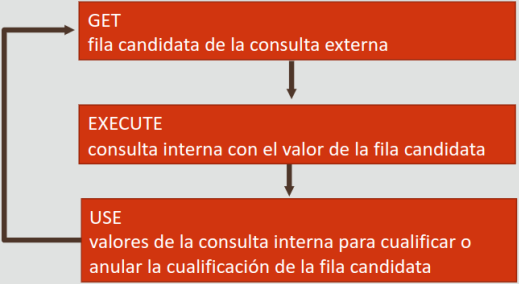

# Oracle Academy: Database Programing with SQL, Parte 10

* [Volver al inicio](index.html)

## 10.1 Conceptos Fundamentales de las Subconsultas

Antes de responder algunas consultas en el mundo real, a veces es necesario
resolver otras consultas más pequeñas, o subconsultas, cuya información es
relevante para la primera. En SQL, las subconsultas nos permiten buscar la
información que necesitamos para obtener la información que deseamos.

### Visión General de las Subconsultas

El acto de poner una consulta dentro de otra se conoce como crear una
subconsulta, la consulta más interna es resuelta primero y luego la información
que devuelva esta es la base para la resolución de la consulta exterior.

Una subconsulta es una sentencia `SELECT` adentro de otra sentencia `SELECT`,
la cuál se ve como esto:

~~~sql
SELECT select_list FROM table WHERE expression operator (SELECT select_list
FROM table);
~~~

Las subconsultas se pueden colocar en una serie de cláusulas SQL, incluída la
cláusula `WHERE`, la cláusula `HAVING` y la cláusula `FROM`.

### Instrucciones para el Uso de Subconsultas

* Las subconsultas deben ir en paréntesis.
* Las subconsultas se colocan a la derecha de la condición de comparación.
* Tanto las consultas externas como internas pueden usar diferentes tablas.
* Sólo se puede usar una cláusula `ORDER BY` para una sentencia `SELECT`, y
debe ser la última cláusula de la consulta externa. Una subconsulta **NO puede
tener su propia cláusula `ORDER BY`**
* El único límite que existe en el número de subconsultas es el tamaño del
buffer que utilice la consulta.

Existen dos tipos de subconsultas:

* De una sola fila: utilizan operadores de una sola fila (>,=,< y sus variantes) y
sólo pueden devolver una fila.
* De varias filas: utilizan operadores de varias filas (IN, ANY, ALL) y devuelven más
de una fila de la consulta interna.

Por ejemplo, para averiguar cuáles empleados fueron contratados después de uno
del que no se conoce su fecha de contratación:

~~~sql
SELECT first_name, last_name, hire_date
FROM employees WHERE hire_date >
  (SELECT hire_date FROM employees WHERE last_name='Vargas');
~~~

La consulta anterior devuelve:

|FIRST_NAME|LAST_NAME|HIRE_DATE|
|---|---|---|
|Elen|Zlotkey|29-Jan-2000|
|Kimberley|Grant|24-May-1999|
|Kevin|Mourgos|16-Nov-1999|
|Diana|Lorentz|07-Feb-1999|

### Subconsultas y Valor Nulo

Si una subconsulta devuelve un valor nulo o ninguna fila, la consulta externa
toma los resultados nulos y los utiliza para sus condiciones.

Por ejemplo:

~~~sql
SELECT department_id
FROM employees WHERE department_id =
  (SELECT department_id FROM employees WHERE last_name='Grant');
-- Grant no tiene un department_id, esta consulta no encontrará resultados
~~~

## 10.2 Subconsultas de Una Sola Fila

Como ya se había mencionado antes, las subconsultas de una sola fila utilizan los
operadores de una sola fila y pueden extraer información de cualquier tabla, además
de sólo devolver una fila. Por ejemplo:

~~~sql
SELECT last_name, job_id, department_id FROM employees
WHERE department_id =
  (SELECT department_id
  FROM departments WHERE department_name='Marketing')
ORDER BY job_id;
~~~

La consulta anterior devuelve:

|LAST_NAME|JOB_ID|DEPARTMENT_ID|
|---|---|---|
|Hartstein|MK_MAN|20|
|Fay|MK_MAN|20|

Pero más de una subconsulta puede devolver información a la consulta externa:

~~~sql
SELECT last_name, job_id, department_id FROM employees
WHERE job_id =
  (SELECT job_id
  FROM employees WHERE employee_id = 141)
AND department_id =
  (SELECT department_id
  FROM departments WHERE location_id=1500);
~~~

La consulta anterior devuelve:

|LAST_NAME|JOB_ID|SALARY|DEPARTMENT_ID|
|---|---|---|---|---|
|Rajs|ST_CLERK|3500|50|
|Davies|ST_CLERK|3100|50|
|Matos|ST_CLERK|2600|50|
|Vargas|ST_CLERK|2500|50|

### Funciones de Grupo en Subconsultas

Las funciones de grupo pueden utilizarse en Subconsultas; estas sólo devuelven
una fila a menos que se utilice una cláusula `GROUP BY`.
Un ejemplo práctico sería averiguar cuales empleados ganas menos del promedio:

~~~sql
SELECT last_name, salary FROM employees
WHERE salary <
  (SELECT AVG(salary)
  FROM employees);
-- la subconsulta retorna 8775
~~~

La consulta anterior devuelve:

|LAST_NAME|SALARY|
|---|---|
|Whalen|4400|
|Giertz|8300|
|Taylor|8600|
|Grant|7000|
|Mourgos|5800|
|Rajs|3500|
|Davies|3100|
|...|...|

### Subconsultas en la Cláusula HAVING

Las subconsultas también pueden colocarse dentro de un `HAVING`. Es común qe
dichas subconsultas incluyan una función de grupo, considerando que las
cláusulas `HAVING` de por sí requieren una.

Por ejemplo, para determinar los departamentos donde el empleado con menos salario
gane más que el empleado con menos salario del departamento 50:

~~~sql
SELECT department_id, MIN(salary)
FROM employees
GROUP BY department_id
HAVING MIN(salary) >
  (SELECT MIN(SALARY)
  FROM employees
  WHERE department_id=50);
-- la subconsulta devuelve 2500
~~~

El resultado de esa consulta sería:

|DEPARTMENT_ID|MIN(SALARY)|
|---|---|
|-|7000|
|90|17000|
|20|6000|
|110|8300|
|80|8600|
|10|4400|
|60|4200|

Una vez seleccionado el salario más bajo del departamento 50, ese valor fue
devuelto a la cláusula `HAVING`, que lo utilizó para filtrar el resto de salarios
mínimos.

## 10.3 Subconsultas de Varias Filas

Las subconsultas de una fila pueden quedarse cortas para algunos casos, a veces
se necesita buscar información basada en varias filas y varios valores, por eso
existen las subconsultas de varias filas.

Para poder manipular la (usualmente) gran cantidad de información devuelta
inicialmente por estas se requere de los operadores especiales `IN`, `ANY` y
`ALL`.

Considere el siguiente caso: se necesita saber cuáles empleados tienen un
salario igual al de todos los empleados que trabajan en el departamento 20.
Esto no puede resolverse con una subconsulta de una fila:

~~~sql
SELECT first_name, last_name FROM employees
WHERE salary =
  (SELECT salary FROM employees
  WHERE department_id=20);
-- la subconsulta interna regresa más de un valor, el motor no sabe cuál escoger
-- para comparar con la consulta superior.
~~~

### IN, ANY y ALL

Los tres operadores `IN`, `ANY` y `ALL` están pensados para poder manipular
consultas que regresen varias filas, y pueden utilizarse con el operador `NOT`.

#### IN

EL operador `IN` se utiliza en la cláusula WHERE y **sirve para determinar qué filas
de una consulta externa pertenecen a los valores devueltos por una subconsulta.**
Por ejemplo, para determinar qué empleados fueron contratados el mismo año que los empleados
del departamento 90:

~~~sql
SELECT last_name, hire_date
FROM employees
WHERE EXTRAC (YEAR FROM hire_date) IN
  (SELECT EXTRACT(YEAR FROM hire_date)
    FROM employees WHERE department_id=90);
~~~

La consulta anterior devuelve:

|LAST_NAME|HIRE_DATE|
|---|---|
|King|17-Jun-1987|
|Kochhar|21-Sep-1987|
|De Haan|13-Jan-1993|
|Whalen|17-Sep-1987|

La consulta interna después de `IN` devuelve una lista de los años de las
fechas de contratación de los empleados del departamento 90. Luego esos años
son utilizados por IN para determinar los empleados que hayan sido contratado
en alguno de esos años.

#### ANY

El operador `ANY` se utiliza cuando deseamos que la cláusula WHERE de la
consulta externa seleccione **las filas que coinciden con los criterios (`<`,
`>`, `=` y variaciones) de AL MENOS UN VALOR en el juego de resultados de
la subconsulta.**

Por ejemplo, la siguiente consulta devuelve cualquier empleado cuyo año de
contratación **sea menor que al menos uno de los años** de las fechas de contratación
de los empleados del departamento 90:

~~~sql
SELECT last_name, hire_date FROM employees
WHERE EXTRACT(YEAR FROM hire_date) < ANY
  (SELECT EXTRACT(YEAR FROM hire_date)
    FROM employees
    WHERE department_id=90);
-- los años devueltos por las subconsulta son 1987, 1989 y 1993
~~~

|LAST_NAME|HIRE_DATE|
|---|---|
|King|17-Jun-1987|
|Kochhar|21-Sep-1989|
|Whalen|17-Sep-1987|
|Hunold|03-Jan-1990|
|Ernst|21-May-1991|

#### ALL

El operador `ALL` se utiliza cuando deseamos que la cláusula `WHERE` de la
consulta externa seleccione las filas que coinciden con los criterios (`<`,
`>`, `=` y variaciones) de TODOS los valores en el juego de resultados de la
subconsulta. **El operador ALL compara un valor con TODOS los valores devueltos
por la consulta interna.** Por ejemplo, para el mismo caso anterior:

~~~sql
SELECT last_name, hire_date FROM employees
WHERE EXTRACT(YEAR FROM hire_date) < ALL
  (SELECT EXTRACT(YEAR FROM hire_date)
    FROM employees
    WHERE department_id=90);
-- los años devueltos por las subconsulta son 1987, 1989 y 1993
~~~

Esta sentencia no regresa ningún valor, porque ninguno de los registros devueltos
por la consulta externa es menor que 1987, 1989 y 1993 al mismo tiempo.

### Valores NULL

Suponiendo que uno de los valores devueltos por una subconsulta de varias filas
es nulo, pero otros no lo son; `IN` y `ANY` devolverán filas que coincidan con los
valores no nulos:

~~~sql
SELECT last_name, employee_id FROM employees
WHERE employee_id IN
  (SELECT manager_id FROM employees);
~~~

La anterior consulta devuelve:

|LAST_NAME|EMPLOYEE_ID|
|---|---|
|King|100|
|Kochhar|101|
|De Haan|102|
|Higgins|205|

**`ALL` no devolverá ninguna fila porque ALL compara la consulta externa
con CADA valor devuelto por la subconsulta, incluído los nulos.**

~~~sql
SELECT last_name, employee_id FROM employees
WHERE employee_id <= ALL
  (SELECT manager_id FROM employees);
~~~

La consulta anterior no devuelve datos, porque hay empleados que no tiene jefe.

### GROUP BY y HAVING

Tanto `GROUP BY` como `HAVING` pueden usarse en subconsultas, y estas tienen sus
casos de uso. Por ejemplo, para hallar los departamentos cuyo salario mínimo sea
inferior al salario de cualquier empleado que trabaje en el departamento 10 o 20:

~~~sql
SELECT department_id, MIN(salary)
FROM employees
GROUP BY department_id
HAVING MIN(salary) < ANY
  (SELECT salary
    FROM employees
    WHERE department_id IN(10,20))
ORDER BY department_id;
-- los salarios devueltos por la subconsulta son 4400, 13000 y 6000
~~~

Los resultados devueltos por esta subconsulta son:

|DEPARTMENT_ID|MIN(salary)|
|---|---|
|10|4400|
|20|6000|
|50|2500|
|60|4200|
|80|8600|
|110|8300|
|-|7000|

### Subconsultas de Varias Columnas

Una subconsulta puede utilizar una o más columnas. Las que usan más de una
columna se denominan subconsultas de varias columnas. Las subconsultas de
varias columnas pueden ser comparaciones pareadas o no. Por ejemplo:

~~~sql
SELECT employee_id, manager_id, department_id
FROM employees
WHERE (manager_id,department_id) IN
  (SELECT manager_id, department_id
    FROM employees
    WHERE employee_id IN(149,174))
AND employee_id NOT IN (149,174)
~~~

La anterior es una subconsulta pareada (ambas columnas de la subconsulta se
están utilizando en una condición) de varias columnas. Esta muestra los
empleados cuyos jefes y departamentos sean los mismo que el jefe y el
departamento de los empleados 149 o 174 (obviamente exceptuándolos a ellos dos).
El resultado es:

|EMPLOYEE_ID|MANAGER_ID|DEPARTMENT_ID|
|---|---|---|---|
|176|149|80|

**Entonces, el empleado 176 tiene el mismo jefe y trabaja en el mismo departamento que
174, y obviamente no es ni 174 ni 149 (ese es su jefe).**

Una versión no pareada de la consulta anterior sería:

~~~sql
SELECT employee_id, manager_id, department_id
FROM employees
WHERE manager_id IN
  (SELECT manager_id, department_id
    FROM employees
    WHERE employee_id IN(149,174))
AND department_id IN
  (SELECT manager_id, department_id
    FROM employees
    WHERE employee_id IN(149,174))
AND employee_id NOT IN (149,174)
~~~

### Último punto sobre las Subconsultas

Algunas subconsultas pueden devolver una o varias filas según los valores de datos
de las fila. Incluso aunque exista la mínima posibildad de devolver varias filas, es
mejor escribir subconsultas de varias filas.

Por ejemplo, la siguiente consulta:

~~~sql
SELECT first_name, last_name, job_id FROM employees
WHERE job_id =
  (SELECT job_id
    FROM employees
    WHERE last_name = 'Ernst');
~~~

Devuelve los siguientes resultados:

|FIRST_NAME|LAST_NAME|JOB_ID|
|---|---|---|
|Alexander|Hunold|IT_PROGR|
|Bruce|Ernst|IT_PROG|
|Diana|Lorentz|IT_PROG|

Esta consulta funciona de momento porque sólo hay un empleado con el apellido
Ernst en la tabla, pero nada impide que en un futuro alguien más entre a la tabla
con el mismo apellido, por lo que habría más de un Ernst.

Lo más sensato es reescribir la misma consulta utilizando un operador de varias
filas:

~~~sql
SELECT first_name, last_name, job_id FROM employees
WHERE job_id IN
  (SELECT job_id
    FROM employees
    WHERE last_name = 'Ernst');
~~~

## 10.4 Subconsultas Correlacionadas

A veces hay ocasiones en que tiene que resolver más de una pregunta antes de
dar una respuesta directa a una interrogante. Por ejemplo, elaborar un informe
de todos los empleados que ganen más que el salario medio de sus departamentos;
primero necesitamos el salario medio por departamento, luego comparar cada
salario medio con el de cada empleado.

Oracle Server realiza una subconsulta correlacionada cuando la subconsulta hace
referencia a una columna de una tabla en la sentencia principal.

Las consultas correlacionadas se evalúan una vez para cada fila procesada por
la sentencia principal. esta sentencia puede ser una sentencia `SELECT`,
`UPDATE` o `DELETE`.

Por ejemplo, para saber de quién es el salario que es mayor al salario medio de
su departamento, hace falta una consulta correlacionada:

~~~sql
SELECT o.first_name, o.last_name, o.salary
FROM employees o WHERE o.salary >
  (SELECT AVG(i.salary)
    FROM employees i
    WHERE i.department_id=o.department_id);
~~~

Esto resultaría en:

|FIRST_NAME|LAST_NAME|SALARY|
|---|---|---|
|Steven|King|24000|
|Shelley|Higgins|24000|
|Eleni|Zlotkey|15000|
|Ellen|Abel|11000|
|Kevin|Mourgos|5800|
|Alexander|Hunold|9000|
|Michael|Hartstein|13000|

Cada subconsulta se ejecuta una vez para cada fila de la consulta externa. En
una subconsulta normal, la cláusula `SELECT` sólo se ejecutaría una vez y antes
que la externa.

### EXISTS y NOT EXISTS

`EXISTS` y `NOT EXISTS` son dos cláusulas que se pueden utilizar al comprobar
las coincidencias de subconsultas. `EXISTS` comprueba un resultado `TRUE` o
coincidente en la subconsulta. Por ejemplo, para determinar qué empleados NO
son jefes:

~~~sql
SELECT last_name AS "Not Manager"
FROM employees emp WHERE NOT EXISTS
  (SELECT * FROM employees mgr
    WHERE mgr.manager_id = emp.employee_id);
~~~

Primero se determina cuáles empleados son jefes (eso se hace en la subconsulta)
luego, se filtra los resultados de la subconsulta con el `NOT EXISTS`:

|Not Manager|
|---|
|Whalen|
|Gletz|
|Abel|
|Taylor|
|Grant|
|Raj|
|Davies|
|Matos|
|Vargas|
|Ernst|
|...|

En comparación con ejecutar esta consulta utilizando `NOT IN`:

~~~sql
SELECT last_name AS "Not Manager"
FROM employees emp WHERE emp.employee_id NOT IN
  (SELECT mgr.manager_id FROM employees mgr);
~~~

**La anterior consulta no regresaría ningún dato. Esto se debe al hecho de que
hay un empleado que no tiene un jefe (su valor es nulo) eso es sufciente para
que la consulta completa falle.**

Existen tres estados en los que puede terminar una subconsulta: `TRUE`, `FALSE`
y `UNKNOWN`. El retorno de valores nulos desemboca en `UNKNOWN`.

Lo mejor es tener precaución a la hora de usar `NOT IN` en subconsultas y usar
`IS NOT NULL` en las condiciones donde se crea que un `NULL` pueda aparecer.
El caso anterior puede resolverse usando `emp.manager IS NOT NULL` o usando
`NOT EXISTS`.

### WITH

Las consultas muy complejas pueden tener muchas uniones y agregaciones
utilizadas varias veces; se puede escribir las distintas partes de la sentencia
como bloques de consulta y utilizarlos en una sola sentencia `SELECT`. Oracle
permite escribir subconsultas con nombre en una sola sentencia, siempre que
empiece su sentencia con la palabra clave `WITH`.

La cláusula WITH recupera los resultados de uno o más bloques de consulta y los
almacena para el usuario que ejecuta la consulta. `WITH` permite generar consultas
más eficientes y fáciles de leer, y se usa de la siguiente manera:

~~~sql
WITH subquery_name AS (subquery),;
  subquery_name AS (subquery)
  SELECT column_list
  FROM { table | subquery_name | view }
  WHERE condition;
~~~

Por ejemplo, para visualizar la lista de apellidos de los empleados no jefes,
primero debe obtener una lista de valores de `manager_id` de la tabla empleados
y devolver los nombres de los empleados que no estén en la lista de jefes.

Podemos crear una subconsulta con nombre mediante la cláusula `WITH` para recuperar
los valores de `manager_id` de `employees` y la consulta externa devolverá los
que no aparezcan en la lista.

~~~sql
WITH managers AS
  (SELECT DISTINCT manager_id FROM employees
    WHERE manager_id IS NOT NULL)
SELECT last_name AS "Not a manager"
FROM employees
WHERE employee_id NOT IN
  (SELECT * from MANAGERS);
~~~

Esa consulta retorna los siguientes resultados:

|Not Manager|
|---|
|Whalen|
|Gletz|
|Abel|
|Taylor|
|Grant|
|Raj|
|Davies|
|Matos|
|Vargas|
|Ernst|
|...|

