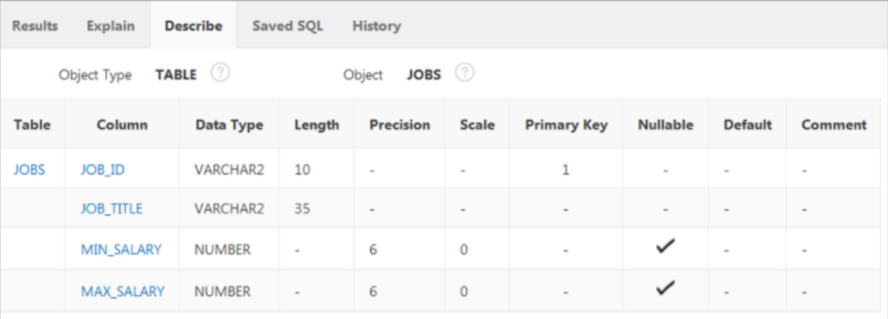

Parte 13

- [13.1 Creación de tablas](#131-creación-de-tablas)
  - [Objetos de Esquema de la Base de Datos](#objetos-de-esquema-de-la-base-de-datos)
  - [Reglas para la Creación de Tablas](#reglas-para-la-creación-de-tablas)
    - [Reglas de Nomenclatura](#reglas-de-nomenclatura)
  - [CREATE TABLE](#create-table)
  - [Sintaxis de CREATE TABLE](#sintaxis-de-create-table)
  - [Tablas Externas](#tablas-externas)
  - [Data Dictionary](#data-dictionary)
- [13.2 Uso de Tipos de Dato](#132-uso-de-tipos-de-dato)
  - [Visión General de Tipo de Dato](#visión-general-de-tipo-de-dato)
    - [Tipos de Dato Comunes](#tipos-de-dato-comunes)
  - [Tipos de dato DATE-TIME](#tipos-de-dato-date-time)
    - [Ejemplos del uso de TIMESTAMP](#ejemplos-del-uso-de-timestamp)
    - [TIMESTAMP With LOCAL Time Zone](#timestamp-with-local-time-zone)
    - [TIMESTAMP With LOCAL TIME ZONE](#timestamp-with-local-time-zone-1)
  - [Tipos de dato INTERVAL](#tipos-de-dato-interval)
    - [`INTERVAL YEAR TO MONTH`](#interval-year-to-month)
    - [`INTERVAL DAY TO SECOND`](#interval-day-to-second)
- [13.3 Modificación de una Tabla](#133-modificación-de-una-tabla)
  - [ALTER TABLE](#alter-table)
  - [Modificación de una Columna](#modificación-de-una-columna)
  - [Borrado de una Columna](#borrado-de-una-columna)
  - [SET UNUSED para Columnas](#set-unused-para-columnas)
  - [DROP TABLE](#drop-table)
  - [FLASHBACK TABLE](#flashback-table)
  - [RENAME](#rename)
  - [TRUNCATE](#truncate)
  - [COMMENT ON TABLE](#comment-on-table)
  - [FLASHBACK QUERY](#flashback-query)

- [Volver al inicio](index.html)

## 13.1 Creación de tablas

Las BBDD interactúan con distintos tipos de objetos, entre los que figuran
tablas normales, esquemas, secuencias, sinónimos, índices, tablas externas, y el diccionario de datos. Una BBDD
puede contener muchos tipos distintos de objetos, algunos de ellos independientes otros no.

### Objetos de Esquema de la Base de Datos

Los principales tipos de objetos de base de datos son las tablas,
los índices, las restricciones, las vistas, las secuencias y los
sinónimos.

Los objetos de la BBDD que ocupan mucho espacio se denominan segmentos
(ejemplos de estos son las tablas y los índices) generalmente tienen filas
asociadas y estas ocupan mucho espacio de almacenamiento en el disco duro.

Las vistas, restricciones, secuencias y sinóminos por otra parte también son
objetos, pero no necesitan espacio porque ninguno tiene filas de datos
asociadas.

El diccionario de datos es un objeto especial que almacena las definiciones de
todos los objetos de la BBDD y los hace accesibles para todos los usuarios y la
BBDD en sí. La forma en que se determina qué columnas devuelve una consulta, es
es consultando la definición de la tabla en el diccionario.

La BBDD utiliza el diccionario en todas las sentencias que emite; comprueba que
las tablas a las que hace referencia en la sentencia existen en la BBDD, que
los nombres de columna sean correctos, si los privilegios del usuario son
correctos y se asiste del diccionario para decidir el plan de ejecución.

Todos los usuarios de la BBDD pueden consultar el diccionario de la BBDD. En Oracle APEX este se puede acceder mediante la sección `SQL Commands > SQL Commands`. Los nombres de las tablas
son desplegados en la interfaz `Object Browser` y al hacer click
en uno de ellos se puede ver sus detalles. El explorador de objetos permite ver los detalles de las tablas, sus opciones para ver los datos, índices, restricciones, concesiones y otros detalles.



_Descripción breve de una tabla a través de Oracle APEX_

### Reglas para la Creación de Tablas

Todos los datos de una BBDD relacional se almacenan en tablas. Al
crear una nueva tabla, utilice las siguiente reglas para los
nombres de tabla y columna:

- Debe empezar por una letra
- Deben tener entre 1 y 30 caracteres
- Sólo puede contener caracteres alfanuméricos (letras del
  abecedario en mayúscula o minúscula, y números) y los caracteres
  especiales `_`, `$` y `#`
- No deben ser un duplicado de otro nombre de objeto propiedad
  del mismo usuario.
- No deben ser ninguna palabra reservada de Oracle Server.

#### Reglas de Nomenclatura

Lo mejor es usas nombres descriptivos para los objetos de la BBDD en general.
Los nombres no son sensibles a mayúsculas (para el motor es lo mismo `ALUMNOS` que `alumnos` o `aLumNoS`) y lo mejor es que de los nombre de tabla sen en plural.

La creación de tablas forma parte del lenguaje de definición de
datos (DDL) de SQL

### CREATE TABLE

Para crear una tabla, debe contar con el privilegio `CREATE TABLE` y un área de almacenamiento para esta. Este y otros permisos son otorgados por el administrador mediante el lenguaje de control de datos `DCL`, así como asigna las áreas de almacenamiento.

Las tablas que le pertenezcan a otro usuario no se incluyen en
el esquema. Si se desea utilizar una tabla que no esté en el esquema, utilice un prefijo en el nombre:

```sql
-- Usando la tabla Stugents propiedad de mary
SELECT * FROM mary.students
```

**Debe tener acceso a una tabla para poder realizar cualquier operación en
ella.**

### Sintaxis de CREATE TABLE

Para crear una nueva tabla, utilice la siguiente sintáxis:

```sql
CREATE TABLE table (column data_typw [DEFAULT expression]),
  (column data_type [DEFAULT expression]),
  (... [...]),
```

Los siguientes son ejemplos de creación de tablas:

```sql
CREATE TABLE my_cd_collection
  (cd_number NUMBER(3),
    title VARCHAR2(20),
    artist VARCHAR2(20),
    purchase_date DATE DEFAULT SYSDATE);

CREATE TABLE my_friends
  (first_name VARCHAR2(20),
    last_name VARCHAR2(30),
    email VARCHAR(30)
    phone_num VARCHAR2(12),
    birth_date DATE);
```

### Tablas Externas

Oracle tiene soporte para crear tablas externas. Este tipo de tablas no existen
como archivos en la BBDD, sino que se almacenan en un archivo plano, externo a
la BBDD. Generalmente se utilizan para migrar datos de versiones anteriores de
las BBDD utilizadas por una compañía.

Cuando una compañía implanta una nueva aplicación y BBDD, suele
tener que importar la mayoría de datos de sus sistemas antiguos
a los más recientes para reestablecer la lectura y escritura normal, pero puede
haber algunos datos no usados con frecuencia, que sólo se tengan que acceder
para lectura. Este tipo ed datos podría alojarse en una tabla externa.

Una de las ventajas de Oracle es que sólo se tiene que hacer una
copia de seguridad una vez de los datos alojados en tablas externas, a menos
que el contenido del archivo cambie.

La sintaxis para crear una tabla externa es la misma que la de
una tabla normal, salvo con algunas palabras reservadas diferentes:

- `ORGANIZATION EXTERNAL`: para indicar que se cree una tabla externa.

- `TYPE ORACLE_LOADER`: de tipo Oracle Loader (producto de Oracle)

- `DEFAULT DIRECTORY def_dir1`: nombre de directorio para el archivo.

- `ACCESS PARAMETTERS`: cómo leer el archivo.

- `RECORDS DELIMITED BY NEWLINE`: cómo identificar el principio
  de una nueva fila

- `FIELDS`: especificaciones de nombre de campo y tipo de dato.

- `LOCATION:` nombre del archivo real que contiene los datos.

El siguiente es un ejemplo de la creación de una tabla externa:

```sql
CREATE TABLE emp_load
  (employee_number CHAR(5),
    employee_dob CHAR(20),
    employee_last_name CHAR(20),
    employee_first_name CHAR(15),
    employee_middle_name CHAR(15),
    employee_hire_date DATE)
ORGANIZATION EXTERNAL
(
  TYPE ORACLE_LOADER
  DEFAULT DIRECTORY def_dir1
  ACCESS PARAMETERS
  (
    RECORDS DELIMITED BY NEWLINE
    FIELDS
    (
      employee_number CHAR(5),
      employee_dob CHAR(20),
      employee_last_name CHAR(20),
      employee_first_name CHAR(15),
      employee_middle_name CHAR(15),
      employee_hire_date DATE date_format DATE mask "mm/dd/yyyy"
    )
  )
  LOCATION('info.dat')
);
```

### Data Dictionary

Existen dos tipos de tablas en una base de datos Oracle: de usuario y de datos.
Se puede acceder a ambos tipos de tabla mediante sentencias SQL, para seleccionar, insertar, actualizar y suprimir datos. También
es posible hacer esto con la tabla de diccionario de datos.

Las tablas del diccionario de datos comprenden, entre otras, las siguientes:

`DICTIONARY_USER_OBJECTS`, `USER_TABLES`, `USER_SEGMENTS`, `USER_INDEXES`.

Las tablas de diccionario de datos son propiedad del usuario reservado `SYS` y sólo deben usarse sentencias SELECT al trabajar con estas tablas. Para protegerlas, se cuenta con vistas
a través de las cuales los usuarios de la BBDD acceden al
diccionario de datos.

**Realizar inserciones, actualizaciones o supresiones una de las tablas del diccionario de datos NO ESTÁ PERMITIDO POR NINGÚN USUARIO DE LA BBDD, YA QUE PODRÍA PONER EN PELIGRO LA INTEGRIDAD DE TODO EL SISTEMA.**

Trabajar con las vistas del diccionario es relativamente sencillo en Oracle, sólo anteceda el prefijo `USER_` o `ALL_` al nombre del objeto en plurar al que se quiera referir. Por ejemplo, para buscar datos sobre las tablas del usuario actual:

~~~sql
SELECT table_name, status FROM USER_TABLES;

-- Para consultar todas las tablas del sistema
SELECT table_name, status FROM ALL_TABLES;
~~~

El caso es similar para otros objetos de la BBDD:

~~~sql
-- Todos los índices creados por ese usuario
SELECT * FROM USER_INDEXES;

-- Todas las secuencias de ese usuario
SELECT * FROM USER_OBJECTS where object_type='SEQUENCE';
~~~

## 13.2 Uso de Tipos de Dato

Cada valor manipulado por una BBDD tiene un tipo de dato asociado, los cuales
tienen diferentes características y su objetivo es facilitar el almacenamiento
eficaz de los datos. El tipo de dato de un valor le asocia un juego fijo de
propiedades a ese valor, la BD trata los valores de una forma diferente u otra
según estas propiedades

### Visión General de Tipo de Dato

Los distintos tipos de dato ofrecen varias ventajas.

* Las columnas de un solo tipo producen resultados consistentes.
* No se puede insertar el tipo de dato incorrecto en una columna.
* Cada columna sólo puede contener un tipo de dato
* No se puede combinar los tipos de dato en una columna.

#### Tipos de Dato Comunes

Algunos de los tipos de dato más utilizados son:

Para valores de caractér:

`CHAR`: tamaño fijo, máximo 2000 caracteres
`VARCHAR2`: tamaño variable, máximo 4000 caracteres
`CLOB`: tamaño variable, máximo de 128 TB

Para valores de número:
`NUMBER`: tamaño variable, máximo 38 dígitos de precisión.

Para valores de fecha y hora:
`DATE`, `TIMESTAMP`, `INTERVAL`.

Para valores binarios (como archivos multimedia: JPG, WAV, MP3, etc...)

* `RAW`: tamaño variable, máximo 2000 bytes
* `BLOB`: tamaño variable, máximo de 128TB.

En general:

* Se prefiere el uso de `VARCHAR2` y `CLOB` sobre `CHAR` porque estos ahorran
  espacio (almacenar la palabra `Chang` en un `VARCHAR2(30)` ocupa 5
  caracteres, en un `CHAR(30)` esto ocuparía los 30 caracteres completos,
  porque llenaría los 25 espacios restantes con caracteres en blanco.))

* Los valores de número pueden ser negativos o positivos. Por ejemplo,
  `NUMBER(6,2)` puede almacenar cualquier valor desde -9999,99 a 9999,99.

### Tipos de dato DATE-TIME

El tipo de dato `DATE` almacena un valor de siglos hasta segundos
enteros, pero no puede almacenar fracciones de segundo.

~~~sql
"21-Aug-2003 17:25:30" -- Valor válido
"21-Aug-2003 17:25:30.255" -- VALOR INVÁLIDO
~~~

El tipo de dato `TIMESTAMP` es una extensión de `DATE` que soporta fracciones
de segundo.

Por ejemplo, `TIMESTAMP(3)` permite 3 dígitos después de los segundos
completos, lo que permite almacenar hasta milisegundos.

#### Ejemplos del uso de TIMESTAMP

~~~sql
CREATE TABLE time_ex1 (exact_time TIMESTAMP);
INSERT INTO time_ex1 VALUES ('10-Jun-2017 10:52:29.123456');
INSERT INTO time_ex1 VALUES (SYSDATE);
INSERT INTO time_ex1 VALUES (SYSTIMESTAMP);
SELECT * FROM time_ex1 VALUES; 
~~~

El conjunto de sentencias anterior retorna el siguiente resultado:

|EXACT_TIME|
|---|
|10-Jun-2017 10:52:29.123456|
|15-Jul-2021 13:52:29.000000|
|15-Jul-2021 13:52:29.567013|

#### TIMESTAMP With LOCAL Time Zone

Además de un instante de tiempo, en muchas ocasiones también
es necesario saber de dónde proviene. Las organizaciones globalizadas actuales operan en muchos países distintos, por lo
que es importante saber a qué sona horario hace referencia un valor fecha-hora-hora.

`TIMESTAMP WITH TIME ZONE` almacena un valor de zona horaria como
un depslazamiento de la hora universal coordinada (o UTC, también conocida como
Hora Media de Greenwich o GMT).

Por ejemplo, un valor "21-Aug-2003 08:00:00 -5:00" significa "8:00 AM 5 horas por debajo de UTC" (esa es la hora oficial oriental de EE.UU.(EST)).

Por ejemplo:

~~~sql
CREATE TABLE time_ex2 (time_with_offset TIMESTAMP WITH TIME ZONE);

INSERT INTO time_ex2 VALUES (SYSTIMESTAMP);

INSERT INTO time_ex2 VALUES (10-Jun-2017 10:52:29.123456 AM +2:00);

SELECT * FROM time_ex2;
~~~

|TIME_WITH_OFFSET|
|---|
|16-Jul-2021 01:52:29.523012 PM -5:00|
|10-Jun-2017 10:52:29.123456 AM +2:00|

#### TIMESTAMP With LOCAL TIME ZONE

Esta variante es igual que `TIMESTAMP WITH TIMEZONE` con la diferencia de que
si esta columna ha sido seleccionada en una consulta, el servidor convierte la
hora automáticamente a la zona horaria del usuario que esté realizando la
sentencia.

~~~sql
CREATE TABLE time_ex3
  (first_column TIMESTAMP WITH TIME ZONE,
  second_column TIMESTAMP WITH LOCAL TIME ZONE);

INSERT INTO time_ex3 (first_column, second_column) VALUES
  ('15-Jul-2017 08:00:00 AM -07:00','15-Nov-2017 08:00:00');
~~~

Ambos valores se almacenan con un desplazamiento de hora de -07:00 horas (PST) pero a un usuario en Estambul la consulta
le aparece de la siguiente forma:

~~~sql
SELECT * FROM time_ex3;
~~~
|FIRST_COLUMN|SECOND_COLUMN|
|---|---|
|15-Jul-2017 08:00:00.000000 AM -7:00|15-Nov-2017 05:00:00.000000 PM|

Esto es porque la hora de Estambul está 9 horas por delante de PST; cuando son
las 8:00 AM en Los Ángeles, son las 5:00 PM en Estambul.

### Tipos de dato INTERVAL

Estos tipos de dato almacenan el tiempo o o intervalo de tiempo
transucrrido entre dos valores de fecha y hora.

#### `INTERVAL YEAR TO MONTH`

Tiempo medido en años y meses.

~~~sql
-- year_precision es el número máximo de dígitos del
-- elemento YEAR. Por defecto es 2.
INTERVAL YEAR [year_precission] TO MONTH;
~~~

Por ejemplo:

~~~sql
CREATE TABLE time_ex4
(
  loan_duration1 INTERVAL YEAR(3) TO MONTH,
  loan_duration2 INTERVAL YEAR(2) TO MONTH
);

INSERT INTO time_ex4 (loan_duration1, loan_duration2) VALUES
(
  INTERVAL '120' MONTH(3),
  INTERVAL '3-6' YEAR TO MONTH
);

-- Suponiendo que la fecha de hoy es 17-Jul-2017
SELECT
  SYSDATE + loan_duration1 AS "120 months from now",
  SYSDATE + loan_duration2 AS "3 years 6 months from now"
FROM time_ex4;
~~~

Las sentencias anteriores dan como resultado:

|120 months from now|3 years 6 months from now|
|---|---|
|17-Jul-2027|17-Jan-2021|

#### `INTERVAL DAY TO SECOND`

Tiempo medido en días, hora, minutos y segundos.

~~~sql
-- day_precision es el número máximo de dígitos del elemento
-- DAY (por defecto es 2)
-- fractional_seconds_precision es el número de dígitos
-- de la parte fraccionaria del campo fecha/hore SECOND. Por
-- defecto es 6
INTERVAL YEAR [(day_precission)] TO SECOND [(fractional_seconds_precision)];
~~~

Por ejemplo:

~~~sql
CREATE TABLE time_ex5
(
  day_duration_1 INTERVAL DAY(3) TO SECOND,
  day_duration_2 INTERVAL DAY(3) TO SECOND,
);

SELECT SYSDATE + day_duration1 AS "25 Days from now",
  TO_CHAR(SYSDATE+day_duration2, 'dd-Mon-yyyy hh:mi:ss')
  AS "precise days and time fron now"
FROM time_ex5;
~~~

Las sentencias anteriores en conjunto dan como resultado:
|25 Days from now|precise days and time from now|
|---|---|
|11 Aug 2021|21 Jul 2021 01:13:17|

## 13.3 Modificación de una Tabla

La naturaleza dinámica de las BBDD es lo que les brinda gran parte de su
utilidad, esta se extiende incluso a la definición de las tablas mismas, pues
existe un subjuego del lenguaje SQL llamado DDL que sirve para modificar,
renombrar, vaciar o eliminar completamente una tabla.

### ALTER TABLE

La sentencia `ALTER TABLE` puede utilizarse para:

* Agregar una nueva columna
* Modificar una columna existente
* Definir un valor `DEFAULT` para una columna
* Borrar una columna

Se puede agregar o modificar una columna, pero no especificar a dónde va a
aparecer. **Una columna recién agregada siempre se convierte en
la última columna de la tabla. SI UNA TABLA YA TIENE FILAS DE DATOS Y AGREGA UNA NUEVA COLUMNA A LA TABLA, LA NUEVA COLUMNA
SERÁ INICIALMENTE NULA PARA TODAS LAS FILAS YA EXISTENTES.**

La sintaxis para agregar una nueva columna a una tabla es la
siguiente:

~~~sql
ALTER TABLE table_name
ADD
( 
  column data type [DEFAULT expression], 
  column data type [DEFAULT expression], ...
);
~~~

Por ejemplo:

~~~sql
ALTER TABLE my_cd_collection
ADD (release_date DATE DEFAULT SYSDATE);

ALTER TABLE my_friends
ADD (favorite_game VARCHAR2(30));
~~~

### Modificación de una Columna

La modificación de una columna puede incluir cambios en el tipo
de dato, tamaño y valor `DEFAULT` de una columna.
Las restricciones al modificar una columna son:

* Se puede aumentar el ancho o precisión de una columna numérica.
* Puede aumentar el ancho de una columna de caracteres.
* Puede reducir el ancho de una columna `NUMBER` **si la columna contiene
  únicamente valores nulos o si la tabla no tiene filas.**
* Para tipos `VARCHAR`, **puede reducir el ancho hasta el mayor
* valor incluído en una columna.**
* Puede cambiar el tipo de datos **sólo si la columna contiene
* valores nulos.**
* **Sólo puede convertir una columna `CHAR` a `VARCHAR2` o viceversa si la columna contiene valores nulos, o si no cambia el
tamaño a algo más pequeño que cualquier valor de columna.**
* **El cambio del valor `DEFAULT` de una columna sólo afecta a
las inseciones posteriores en la tabla.**

Por ejemplo:

~~~sql
-- sólo estaría permitida si las columnas estuvieran vacías o el
-- nombre más largo tuviera 10 caracteres o menos
ALTER TABLE mod_emp MODIFY (last_name VARCHAR2(10));

-- estaría permitida con o sin datos ya que aumenta el ancho de
-- la columna
ALTER TABLE mod_emp MODIFY (last_name VARCHAR2(30));
~~~

Otro ejemplo, se ha creado una tabla con dos columnas:

~~~sql
CREATE TABLE mod_emp (last_name VARCHAR2(20), salary NUMBER(8,2));
~~~

¿Cuál de las siguientes modificaciones estaría permitida y
cuál no?:

~~~sql

-- está permitida con o sin datos ya que aumenta la precisión
ALTER TABLE mod_emp MODIFY (las_name VARCHAR2(30));

-- sólo estaría permitido si la columna tiene valores nulos o si
-- no tiene ningún valor de más de 10 caracteres
ALTER TABLE mod_emp MODIFY (las_name VARCHAR2(10));

-- no estaría permitido porque se está tratando de incrementar
-- la precisión de un NUMBER
ALTER TABLE mod_emp MODIFY (salary NUMBER(10,2));

-- se permitiría con o sin datos ya que sólo agrega un valor default
ALTER TABLE mod_emp MODIFY (salary NUMBER(8,2) DEFAULT 50);
~~~

### Borrado de una Columna

Al borrar una columna se aplican las siguientes reglas:

* Se pueden borrar columnas con datos.
* Sólo puede borrarse una columna a la vez.
* **No se pueden borrar todas las columnas de una tabla, debe
al menos permanecer una.**
* **Una vez borrada la columna, los valores de datos de esta no
se pueden recuperar.**

La sintaxis es:

~~~sql
ALTER TABLE tablename DROP COLUMN column_name;
~~~

Por ejemplo

~~~sql
ALTER TABLE my_cd_collection DROP COLUMN release_date;
ALTER TABLE my_friends DROP COLUMN favorite_game;
~~~

### SET UNUSED para Columnas

A veces borrar una columna de una tabla grande puede llevar mucho tiempo, una
alternativa rápida en caso de un apuro es marcarla como no utilizable; una
columna marcada de esta forma no puede accederse por ningún medio, hasta puede
agregar una columna nueva con el mismo nombre si lo desea.
Esto se hace mediante las palabras reservadas `SET UNUSED`, cuya sintaxis es:

~~~sql
ALTER TABLE tablename SET UNUSED (column_name);
~~~

Por ejemplo:

~~~sql
ALTER TABLE copy_employees SET UNUSED (email);
~~~

Adicionalmente, puede eliminar rápidamente todas las columnas
marcadas como no utilizadas, mediante la sentencia:

~~~sql
ALTER TABLE copy_employees DROP UNUSED COLUMNS;
~~~

### DROP TABLE

La sentencia `DROP TABLE` elemina la definición de una tabla de
Oracle. La BD pierde todos los datos de la tabla y los índices
asociados a los mismos. **Eliminar una tabla SUPRIME TODOS LOS
DATOS DE LA TABLA Y ELIMINA SU DESCRIPCIÓN DEL DICCIONARIO DE
DATOS. Oracle Server no cuestiona la decisión y BORRA LA TABLA
INMEDIATAMENTE.**

Sólo el creador de la tabla o un usuario con el privilegio
`DROP ANY TABLE` (usualmente sólo el DBA) puede eliminar una
tabla:

~~~sql
-- eliminando la tabla copy_employees
DROP TABLE copy_employees;
~~~

### FLASHBACK TABLE

Oracle Server le permite recuperar una tabla borrada accidentalmente. Cada usuario tiene su propia papelera de reciclaje donde se mueven los objetos borrados y se pueden recuperar mediante el comando `FLASHBACK TABLE`. La sintáxis
es:

~~~sql
FLASHBACK TABLE table_name TO BEFORE DROP;
~~~

**COMO PROPIETARIO DE UNA TABLA, puede emitir el comando `FLASHBACK` y si la
tabla que está restaurando tenía índices, estos se restauran.** Es posible ver
los objetos que se pueden restauran consultando la vista del diccionario
`USER_RECYCLEBIN`. Por ejemplo, restaurando la tabla que eliminamos
anteriormente:

~~~sql
FLASHBACK TABLE copy_employees TO BEFORE DROP;
~~~

Esto podría realizarse porque el diccionario de datos tendría almacenada la
siguiente información, accesible desde `USER_RECYCLEBIN`:

|ORIGINAL_NAME|OPERATION|DROPTIME|
|---|---|---|
|EMPLOYEES|DROP|2021-07-17:12.34.34|
|EMP_PK|DROP|2021-07-17:12.34.34|

**Pero una vez se restaura una tabla ya no se puede ver su entrada
en `USER_RECYCLEBIN`.**

**EXISTE UNA FORMA DE BORRAR UNA TABLA OMITIENDO LA PAPELERA DE
RECICLAJE, ESTA ES USANDO LA PALABRA `PURGE`**

~~~sql
-- eliminando la tabla copy_employees
DROP TABLE copy_employees PURGE;
~~~

### RENAME

La sentencia `RENAME` se utiliza para cambiar el nombre de una tabla a otro;
esto es algo que sólo el propietario de la tabla  o un DBA pueden hacer.

La sintáxis es:

~~~sql
RENAME old_name to new_name;
~~~

Por ejemplo:

~~~sql
RENAME my_cd_collection to my_music;
~~~

También es posible renombrar otros objetos como vistas, secuencias y sinónimos.

### TRUNCATE

**Al truncar una tabla, se eliminan todas las filas de una tabla
y se libera el espacio de almacenamiento utilizado por dicha
tabla, COSA QUE NO SUCEDE UTILIZANDO `DELETE`**

`TRUNCATE TABLE` tiene algunas reglas:

* **NO SE PUEDE REALIZAR `ROLLBACK` DE LA ELIMINACIÓN DE FILAS.**
* Debe ser el propietario de la tabla o tener privilegios del
sistema `DROP ANY TABLE`.
* **`TRUNCATE` no genera información de `ROLLBACK`, por lo que
es más rápido que `DELETE`**

La sintáxis para usar `DELETE` es la siguiente:

~~~sql
TRUNCATE TABLE tablename
~~~

### COMMENT ON TABLE

Puede agregar un comentario de hasta 2000 caracteres sobre una
columna, tabla o vista mediante la sentencia `COMMENT`

La sintáxis es la siguiente:

~~~sql
COMMENT ON TABLE tablename | COLUMN table.colummn IS 'place your coment here'
~~~

Por ejemplo:

~~~sql
COMMENT ON TABLE employees IS 'Western Region Only'
~~~

Para ver los comentarios de la tabla en el diccionario de datos:

~~~sql
SELECT table_name, comments FROM user_tab_comments;
~~~

|TABLE_NAME|COMMENTS|
|---|---|
|EMPLOYEES|Western Region Only|

Si desea borrar un comentario realizado anteriormente en una
tabla o columna, utilice la cadena vacía:

~~~sql
COMMENT ON TABLE employee IS '';
~~~

### FLASHBACK QUERY

Puede que detecte que los datos en una tabla se han cambiado de
forma incorrecta. Por suerte, Oracle Server tiene una función
que permite ver los datos de fila en momento concretos en el
tiempo, por lo que puede comparar diferentes versiones de una
fila a lo largo del tiempo.
Un error al ejecutar una sentencia DML puede llegar a suceder más seguido de lo
esperado, ya que Oracle APEX confirma automáticamente los cambios al servidor.

`FLASHBACK QUERY` permite examinar el aspecto de una fila ANTES
de que se aplicaran cambios de una transacción. Cuándo Oracle cambia los datos,
siempre mantiene una copia del aspecto de los datos corregidos antes de que se
realize cualquier cambio **(o sea, Oracle almacena una copia de un valor para
una actualización de columna, una fila completa para una supresión y nada para una inserción).**

Estas copias antiguas se mantienen en un lugar especial denominado el
tablespace `UNDO`; los usuarios pueden acceder a esta zona especial de la BD mediante una consulta flashback. Esto se
hace utilizando la cláusula `VERSIONS` en una sentencia `SELECT`.

Por ejemplo:

~~~sql
SELECT employee_id, first_name||' '||last_name AS NAME,
  versions_operation AS "OPERATION",
  versions_starttime AS "START DATE",
  versions_endtime AS "END DATE", salary
FROM employees
  -- SCN es un número de cambios en el sistema, una identificación
  -- precisa del tiempo en la BD, es secuencial y lo
  -- mantiene la misma BD
  VERSIONS BETWEEN SCN MINVALUE AND MAXVALUE
WHERE employee_id=1;
~~~

Esta sentencia no devolvería nada, porque no hay un empleado con ese ID en la
tabla, pero para el ejemplo práctico, insertemos el empleado 1 en la tabla.

~~~sql
INSERT INTO copy_employees
VALUES (
  1, 'Natacha', 'Hansen', 'NHANSEN', '4412312341234',
  '07-Sep-1998', 'AD_VP', 12000, null, 100, 90, NULL
);

-- tras insertar el empleado, ahora sí debería haber una entrada
-- en el historial
SELECT employee_id, first_name||' '||last_name AS NAME,
  versions_operation AS "OPERATION",
  versions_starttime AS "START DATE",
  versions_endtime AS "END DATE", salary
FROM employees
  VERSIONS BETWEEN SCN MINVALUE AND MAXVALUE
WHERE employee_id=1;
~~~

La respuesta de esas sentencias es la siguiente:

|EMPLOYEE_ID|NAME|OPERATION|START_DATE|END_DATE|SALARY|
|---|---|---|---|---|---|
|1|Natacha Harsen|I|07-SEP-1998 06.51.58 AM|-|12000|

Ahora probemos actualizando la fila anterior

~~~sql
UPDATE copy_employees SET salary=1 WHERE employee_id=1;
-- ahora volvemos a ejecutar la misma sentencia; el sistema
-- debe haber registrado dos cambios para este empleado: la inserción y la
-- actualización de su salario.
SELECT employee_id, first_name||' '||last_name AS NAME,
  versions_operation AS "OPERATION",
  versions_starttime AS "START DATE",
  versions_endtime AS "END DATE", salary
FROM employees
  VERSIONS BETWEEN SCN MINVALUE AND MAXVALUE
WHERE employee_id=1;
~~~

|EMPLOYEE_ID|NAME|OPERATION|START_DATE|END_DATE|SALARY|
|---|---|---|---|---|---|
|1|Natacha Harsen|U|07-SEP-1998 06.57.01 AM|-|1|
|1|Natacha Harsen|I|07-SEP-1998 06.51.58 AM|-|12000|

Ahora, eliminando dicha fila, se obtiene el siguiente resultado:

~~~sql
DELETE FROM employees WHERE employee_id=1;

-- eso debió registrar un tercer cambio en el sistema
SELECT employee_id, first_name||' '||last_name AS NAME,
  versions_operation AS "OPERATION",
  versions_starttime AS "START DATE",
  versions_endtime AS "END DATE", salary
FROM employees
  VERSIONS BETWEEN SCN MINVALUE AND MAXVALUE
WHERE employee_id=1;
~~~

|EMPLOYEE_ID|NAME|OPERATION|START_DATE|END_DATE|SALARY|
|---|---|---|---|---|---|
|1|Natacha Harsen|D|07-SEP-1998 07.00.01 AM|-|1|
|1|Natacha Harsen|U|07-SEP-1998 06.57.01 AM|-|1|
|1|Natacha Harsen|I|07-SEP-1998 06.51.58 AM|-|12000|

CABE RESALTAR: LA ANTERIOR SENTENCIA `SELECT` FUNCIONÓ GRACIAS
A LA PALABRA RESERVADA `VERSIONS`. SI NO HUBIERA SIDO POR ESTA,
LA CONSULTA HUBIERA DADO ERROR, YA QUE EL EMPLEADO CON ID 1 FUE
ELIMINADO


~~~sql
select employee_id, salary FROM employees
WHERE employee_id =1;
-- la consulta anterior da error
~~~

