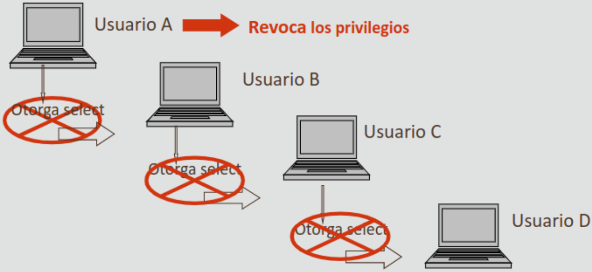
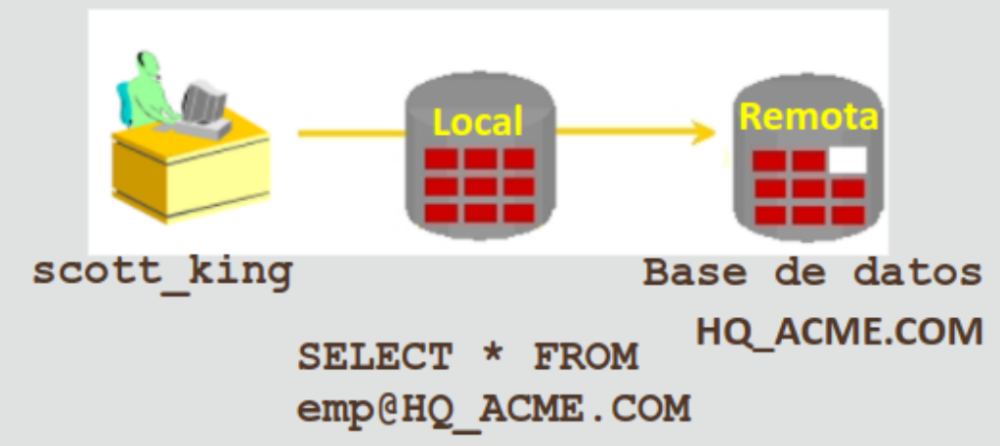

- [Volver al inicio](index.html)

## 17.1 Control de Acceso de los Usuarios

En cualquier espacio de trabajo, la seguridad de los datos es muy
importante y es el mismo caso de las BBDD. Se puede otorgar o quitar acceso a objetos de la BD como medio para controlar quién
puede modificar, suprimir, actualizar, insertar, indexar o hacer
referencia a a los objetos que la componen.

Con la seguridad de la BD del servidor de Oracle, puede
realizar lo siguiente;

- Controlar el acceso a la BD.
- Proporcionar acceso a objetos específicos.
- Confirmrar los privilegios asignados y recibidos en el diccionario de datos
  de Oracle.
- Crear sinónimos para los objetos de la BD.

### Seguridad de la Base de Datos

La seguridad de la BD se puede clasificar en dos categorías: seguridad del sistema y seguridad de los datos.

**La seguridad del sistema abarca el acceso a la BD en el nivel
del sistema,** como la creación de usuarios, sus nombres y contraseñas, la asignación de espacio en disco para cada usuario y la concesión de priviliegios del sistema que los usuarios
pueden llevar a cabo, como crear tablas/vistas/secuencias. Oracle
server posee más de 100 privilegios distintos.

**La seguridad de datos o seguridad de objetos está relacionada
con los privilegios de objeto que abarca el acceso y uso de
objetos de la BD por parte de los usuarios.** Entre estos privilegios se encuentra poder realizar sentencias DML.

### Privilegios y Esquemas

Los privilegios son el derecho a ejecutar sentencias SQL
determinadas. El DBA es un usuario de alto nivel con capacidad
para otorgar a los usuarios acceso a la BD y sus objetos. **Los
usuarios necesitan privilegios del sistema para poder acceder a
la BD, y privilegios de objeto para poder manipular el
contenido de la BD. ADICIONALMENTE, también se les puede dar el
privilegio de otorgar privilegios adicionales a otros usuarios o ROLES, que son grupos con nombres de privilegios relacionados.**

Un esquema es una recopilación de objetos, como tablas, vistas y
secuencias. El esquema es propiedad de un usuario de base de
datos y tiene el mismo nombre que el usuario. El formato de nombre de usuario puede variar dependiendo de la organización. En
el caso de este curso, sigue la convención
`pais/estado_escuela_curso_numero-de-alumno`, por ejemplo `uswa_skhs_sql01_s22`.

### Seguridad del Sistema

Este nivel de seguridad abarca el acceso y uso de la BD en el
nivel del sistema, y comprende más de 100 privilegios. Existen
privilegios en este nivel que sólo suele tener un DBA, como la
capacidad de crear o eliminar usuarios, eliminar tablas o
realizar copias de seguridad. Algunos de esos privilegios son:

- `CREATE USER`: puede crear otros usuarios de
  Oracle (necesario para un DBA).

- `DROP USER`: puede borrar otro usuario.

- `DROP ANY TABLE`: puede borrar una tabla en cualquier esquema.

- `BACKUP ANY TABLE`: puede realizar una copia de seguridad de tablas en cualquier esquema o con la utilidad de exportación.
- `SELECT ANY TABLE`: puede consultar las vistas, instantáneas o tablas en cualquier esquema.
- `CREATE ANY TABLE`: puede crear una tabla en cualquier esquema.

El DBA, o cualquiera con el privilegio de `CREATE USER` puede crear un usuario con la sentencia `CREATE USER`; esto crea un usuario **sin privilegios:**

```sql
CREATE USER user IDENTIFIED BY password;

-- ejemplo de la creación de un usuario
CREATE USER scott IDENTIFIED BY ur35scott;
```

También se puede alterar la contraseña mediante la sentencia
`ALTER USER`:

```sql
ALTER USER scott IDENTIFIED BY imscott35;
```

#### Privilegios del Sistema de Usuario

El DBA puede usar la sentencia `GRANT` para asignar privilegios
del sistema a un usuario. Estos determinan lo que el usuario
puede realizar en el nivel de la BD.

Una vez se le han otorgado los privilegios, el usuario los
puede utilizar inmediatamente:

```sql
GRANT privilege [, privilege, ...]
TO user [, user, ...];
```

Por ejemplo:

```sql
GRANT create session, create table, create sequence, create view
TO scott;
```

**PARA PODER ACCEDER A UNA BD, UN USUARIO DEBE TENER UN PRIVILEGIO `CREATE SESSION` Y UN IDENTIFICADOR DE USUARIO.**

**No puede emitir el comando `CREATE SESSION` en Oracle APEX, este se produce de forma automática en segundo plano**

- `CREATE SESSION`: permite conectar a la BD.
- `CREATE TABLE`: permite crear tablas en el esquema del usuario.
- `CREATE SEQUENCE`: permite crear una secuencia en el esquema del usuario.
- `CREATE VIEW`: permite crear una vista en el esquema del usuario.
- `CREATE PROCEDURE`: permite crear un paquete/función/procedimiento en el esquema del usuario.

### Seguridad de Objetos

Este nivel de seguridad abarca el acceso y uso de objetos de la
BD así como las acciones que los usuarios pueden realizar en
dichos objetos.

Cada objeto tiene un juego determinado de privilegios que se le
pueden otorgar. En la siguiente tabla se pueden ver los privilegios disponible para cada objeto:

| Privilegio | Tabla | Vista | Secuencia | Procedimiento |
| ---------- | ----- | ----- | --------- | ------------- |
| ALTER      | X     |       | X         |               |
| DELETE     | X     | X     |           |               |
| EXECUTE    |       |       |           | X             |
| INDEX      | X     | X     |           |               |
| INSERT     | X     | X     |           |               |
| REFERENCES | X     |       |           |               |
| SELECT     | X     | X     | X         |               |
| UPDATE     | X     | X     |           |               |

Hay que tener en cuenta algunos puntos sobre los privilegios de
objeto:

- Los únicos privilegios aplicados a una secuencia son `SELECT` y `ALTER`.

- Una secuencia utiliza `ALTER` para cambiar las opciones `INCREMENT`,
  `MAXVALUE`, `CACHE/NOCACHE` o `CYCLE/NOCYCLE`.

- La opción `START WITH` no se puede cambiar mediante `ALTER`.

- **Los privilegios `UPDATE`, `REFERENCES` e `INSERT` pueden otorgarse a
  columnas individuales.**

- **NO SE PUEDE OTORGAR `SELECT` A COLUMNAS INDIVIDUALES, debe otorgárselo a
  una tabla completa o crear una vista específica y otorgarle privilegios a esa
  vista.**

- Un privilegio otorgado en un sinónimo se convierte en un privilegio en la
  tabla base a la que hace referencia el sinónimo. El uso de este nombre para
  otorgar un privilegio es lo mismo que otorga el privilegio en la propia
  tabla.

### Palabra clave PUBLIC

Un propietario de una tabla puede otorgar acceso a todos los
usuarios mediante la palabra clave `PUBLIC`. En el siguiente ejemplo, se permite a todos los usuarios del sistema consultar
datos de la tabla `departments` de Alice:

```sql
GRANT select
ON alice.departments
TO PUBLIC;
```

**Si una sentencia no utiliza el nombre completo de un objeto, ORACLE SERVER
INCLUYE IMPLÍCITAMENTE EN EL NOMBRE DEL OBJETO EL NOMBRE DEL USUARIO (O
ESQUEMA) ACTUAL COMO PREFIJO.**

Por ejemplo, si el usuario `scott` intenta consultar una tabla llamada
`departments` a secas, el sistema intetará buscar primero la tabla
`scott.departments`.

**Si una sentencia no utiliza el nombre completo de un objeto y el usuario actual no es propietario de
un objeto con ese nombre, el sistema utiliza el prefijo `PUBLIC` en lugar del nombre del usuario.**

Por ejemplo, tras no localizar el objeto `scott.departments` del ejemplo
anterior (o sea, `scott` no es propietario de ningún objeto llamado
`departments`), el sistema intentará buscar el objeto `public.departments` en
el diccionario de datos.

Otro ejemplo, si el mismo usuario `scott` consulta la vista `USER_OBJECTS` y este no es propietario
de dicha tabla, el sistema realiza selecciones en la vista del
diccionario de datos mediante el sinónimo público `PUBLIC.USER_OBJECTS`.

### Confirmación de Privilegios Otorgados

Si intenta realizar una operación no autorizada, como la supresión de una fila
de una tabla en la que no tiene el privilegio `DELETE`, el servidor de Oracle
no permite que se realice esa acción.

Un mensaje de error de la forma `table or view does not exists` significa que:

- Asignó un nombre a una tabla o vista que no existe.

- Intenta realizar una operación en una tabla o vista para
  la que no tiene privilegios adecuados.

### Visualización de Privilegios

Puede acceder al diccionario de datos para ver los privilegios
que tiene. A continuación, sedescriben varias de las
vistas del diccionario de datos. Se puede acceder a ellas en
Oracle APEX mediante la sección SQL Workshop, Utilites, Objects
Reports. Los privilegios del usuario se pueden ver en la sección
Security Reports.

- `ROLE_SYS_PRIVS`: privilegios del sistema otorgados a roles.
- `ROLE_TAB_PRIVS`: privilegios de tabla otorgados a roles.
- `USER_ROLE_PRIVS`: roles a los que puede acceder un usuario.
- `USER_TAB_PRIVS_MADE`: privilegios de objeto otorgados a objetos del usuario.
- `USER_TAB_PRIVS_RECD`: privilegios de objeto otorgados al usuario.
- `USER_COL_PRIVS_MADE`: privilegios de objetos otorgados a columnas de objetos
  del usuario.
- `USER_COL_PRIVS_RECD`: privilegios de objeto otorgados al usuario en columnas
  específicas.
- `USER_SYS_PRIVS`: privilegios del sistema otorgados al usuario

## 17.2 Creación y Revocación de Privilegios de Objeto

### Los Roles

Un rol es un grupo con nombre de privilegios relacionados que se
pueden otorgar a un usuario, es un método para facilitar la
revocación y mantenimiento de privilegios.
Un usuario puede tener acceso a diferentes roles y el mismo rol
se puede asignar a diferentes usuarios. Los roles son creados
para una aplicación de base de datos.

Para crear y asignar un rol, el DBA debe crear roles primero, luego asignarle privilegios a esos roles:

```sql
-- creando un rol y asignándole privilegios
CREATE ROLE manager;
GRANT create table, create view TO manager;

-- asignando un rol a un usuario
GRANT manager TO jennifer_cho;
```

En la sentencia anterior, le asignamos el role `manager` a `jennifer_cho`, por lo que ahora puede crear vistas y tablas.

**Otorgar varios roles a un usuario le asocia todos los
privilegios asociados a todos los roles.**

**Cabe aclarar que `CREATE ROLE` es un privilegio del sistema que
no se ha emitido para las clases de Academy.**

### Asignación de Privilegios de Objeto

Utilice la siguiente sintáxis para otorgar privilegios de
objeto:

```sql
GRANT object_priv [(column_list)]
ON object_name
TO {user|role|PUBLIC}
  [WITH GRANT OPTION];
```

Donde:

- `object_priv`: privilegio de objeto a otorgar.

- `column_list`: columna de una tabla o vista en la que se otorgan los
  privilegios.

- `ON object name`: es el objeto sobre el que se otorgan los privilegios.

- `TO user|role`: identifica el usuario o rol al que se le otorga el
  privilegio.

- `PUBLIC`: otorga privilegios de objeto a todos los usuarios.

- `WITH GRANT OPTION`: permite al usuario con privilegios otorgar privilegios
  de objeto a otros usuarios y roles.

### Directrices de Privilegios de Objeto

- **Para otorgar privilegios en un objeto, el objeto debe estar en el propio
  esquema o debe otorgar el propio privilegio con `WITH GRANT OPTION`**

- **Un propietario de objeto puede otorgar privilegios de objeto en el objeto a
  cualquier otro usuario o rol de la BD.**

- **El propietario de un objeto adquiere automáticamente todos los privilegios
  de objeto en dicho objeto.**

#### Ejemplos de GRANT

```sql
-- Un usuario llamado scott_king ha creado una tabla de
-- clientes. En el siguiente ejemplo, a todos los usuarios se
-- ha otorgado el permiso `SELECT` en la tabla de clientes de
-- scott_king:
GRANT SELECT ON clients TO PUBLIC;

-- ahora se van a otorgar privilegios UPDATE a Jennifer y al
-- rol de gestor en columnas específicas de la tabla de clientes
-- de Scott
GRANT UPDATE (first_name, last_name)
ON clients
TO jennifer_cho, manager;

-- si Jennifer ahora desea SELECCIONAR datos de la tabla de Scott,
-- la sintaxis que debe utilizar es la siguiente
SELECT * FROM scott_king.clients;

-- ahora Jennifer puede crear un sinónimo para la tabla de
-- Scoott y SELECCIONAR en el sinónimo
CREATE SYNONYM clients
FOR scott_king.clients;

SELECT * FROM clients;
```

Hay disponibles diferentes privilegios de objeto para distintos
tipos de objetos de esquema. Unn usuario automáticamente tiene
todos los privilegios de objeto para los objetos de esquema que
están en su esquema. **UN USUARIO PUEDE OTORGAR PRIVILEGIOS DE
OBJETO SOBRE CUALQUIER OBJETO DE ESQUEMA QUE EL USUARIO POSEA A
OTRO USUARIO O ROL.**

### WITH GRANT OPTION

El usuario con privilegios puede transferir un privilegio que se
otorga con la cláusula `WITH GRANT OPTION` a otros usuarios y
roles. **Los privilegios de objeto otorgados con la cláusula `WITH GRANT OPTION` se revocan si se revoca el privilegio del otorgante.**

En el siguiente ejemplo, se proporciona al usuario Scott acceso a
una tabla de clientes con los privilegios para consultar la tabla
y agregar filas a la tabla. Además, también se permite a Scott
otorgar a otros usuarios estos privilegios:

```sql
GRANT SELECT, INSERT
ON clients
TO scott_king
WITH GRANT OPTION;
```
### Palabra clave PUBLIC

**El propietario de una tabla puede otorgar acceso a TODOS LOS USUARIOS mediante la palabra `PUBLIC`.**

Por ejemplo, el siguiente ejemplo permite a todos los usuarios
del sistema consultar datos de la tabla clientes de Jason:

```sql
GRANT SELECT
ON jason_tsang.clients
TO PUBLIC;
```

### Revocación de Privilegios de Objeto

Puede eliminar los privilegios otorgados a otros usuarios
mediante la sentencica `REVOKE`. **Al utilizar la sentencia
`REVOKE`, los privilegios que especifique se revocarán a los
usuarios que designe y a otoros usuarios a los que haya otorgado
esos privilegios con las palabras clave `WITH GRANT OPTION`.**

La siguiente sintáxis permite revocar los privilegios de un
objeto:

```sql
REVOKE {privilege [, privilege]|ALL}
ON object
FROM {user [, user]|role|PUBLIC}
[CASCADE CONSTRAINTS];
```

**`CASCADE CONSTRAINTS` ES OBLIGATORIO PARA ELIMINAR TODAS LAS
RESTRICCIONES DE INTEGRIDAD REFERENCIALES REALIZADAS SOBRE EL
OBJETO MEDIANTE EL PRIVILEGIO `REFERENCES`.**

#### WITH GRANT OPTION

En el siguiente ejemplo, se revocan los privilegios `SELECT` e
`INSERT` proporcionados al usuario Scott en la tabla de clientes:

```sql
REVOKE SELECT, INSERT
ON clients
FROM scott_king;
```

Si se otorga a un usuario un privilegio con la cláusula `WITH GRANT OPTION`, dicho usuario también puede otorgar el privilegio
mediante la cláusula `WITH GRANT OPTION`. **Esto significa que es posible una
larga cadena de usuarios con privilegios, PERO NO SE PERMITE OTORGAR
PRIVILEGIOS DE FORMA CIRCULAR.**

\*_Si el propietario revoca un privilegio de un usuario que ha
otorgado privilegios a otros usuarios, LA SENTENCIA DE REVOCACIÓN
TIENE UN EFECTO EN CASCADA EN TODOS LOS PRIVILEGIOS OTORGADOS._

Por ejemplo, si el usuario A otorga un privilegio `SELECT` en una
tabla al usuario B, con la cláusula `WITH GRANT OPTION`, el
usuario B puede otorgar al usuario C el privilegio `SELECT`
también con la cláusula `WITH GRANT OPTION`. Ahora C puede otorgar ese
privilegio al usuario D, si así lo desea. **Pero si el usuario revoca los
privilegios del usuario B, los privilegios otorgados a los usuarios C y D
también se revocan:**



_Ilustración del revocado de privilegios en cascada._

### Sinónimos Privados y Públicos

Un sinónimo puede ser privado **(lo son por defecto)** o público.

Un sinónimo público lo pueden crear los administradores de BD o
usuarios de BD a los que se haya dado privilegios para hacerlo,
pero no todo el mundo puede crear automáticamente sinónimos
públicos.

Nota: el privilegio `CREATE PUBLIC SYNONYM` no se ha otorgado a
los alummnos de Academy.

### Roles y Privilegios

Los roles y privilegios difieren de varias formas:

Un privilegio es un derecho para ejecutar un tipo concreto de
sentencia SQL o acceder al objeto de otro usuario.
Oracle define TODOS los privilegios.

Por otra parte, lor roles son creados por usuarios (normalmente
administradores) y se utilizan para agrupar los privilegios y/o
otros roles. Los privilegios se incluyen con la BD y los roles
los realizan los administradores de BD o los usuarios de una BD
concreta.

### Enlaces de Base de Datos

Un enlace de base de datos es un puntero que define una ruta de
acceso de comunicación unidireccional de una BD Oracle a otra
BD. **El puntero de enlace se define realmente como una entrada
en la tabla del diccionario de datos.**

**Para acceder al enlace, debe estar conectado a la BD local que
contiene la entrada del diccionario de datos.**

Una conexión de enlace de BD es "unidireccional" en el sentido
de que un cliente conectado a la BD local A puede utilizar un
enlace almacenado en la BD A para acceder a la información de la
BD remota B, pero los usuarios conectados a la BD remota B no
pueden utilizar el mismo enlace para acceder a los datos de la
base de datos A.

**Una conexión de enlace de base de datos proporciona a los
usuarios locales acceso a los datos en una BD remota.**

Esta es una funcionalidad no disponible en Oracle APEX, ya que
no hay una conexión constante a la BD.

[//]: # "Investigar sobre Oracle CREATE DATABASE LINK"

Si los usuarios de la BD B desearan acceder a los datos de la BD
A, se debe definir un enlace, el cual queda almacenado en la BD B.

Para que esta conexión se produzca, cada BD del sistema distribuído debe
tener un nombre de BD global único.

El nombre de BD global identifica de forma única un servidor de
BD en un sistema distribuído.

La gran ventaja de los enlaces de BD es que permiten a los
usuarios acceder a objetos de otros usuarios en una BD remota,
para que estén limitados por por el juego de privilegios del
propietario del objeto. **Es decir, un usuario local puede
acceder a una BD remota sin tener un usuario en la BD remota.**

Por ejemplo, en la siguiente ilustración se muestra al usuario
`scott_king` que accede a la tabla `EMP` en la BD remota con el
nombre global `HQ.ACME.COM`:



La vista del diccionario `USER_DB_LINKS` contiene información
sobre los enlaces a los que tiene acceso un usuario.

Una vez se ha creado el enlace de BD, puede escribir sentencias
SQL para datos en el sitio remoto.

Si se configura un sinónimo, puede escribir sentencias SQL
mediante el sinónimo.

Por ejemplo:

```sql
CREATE PUBLIC SYNONYM HQ_EMP
FOR emp@HQ.ACME.COM;
```

A continuación, escriba la sentencia SQL que utiliza el sinónimo:

```sql
SELECT * FROM HQ_EMP;
```

**Nota: NO PUEDE OTORGAR PRIVILEGIOS EN OBJETOS REMOTOS**

## 17.3 Expresiones Regulares

Hasta ahora, ha realizado coincidencias en patrones de texto
utilizando la palabra `LIKE` y comodines simples. En ocasiones,
las búsquedas de patrones que necesite realizar pueden ser más
complejas, por ejemplo el extraer todas las URL de un fragmento
de texto.

Las expresiones regulares son un método de descripción de
patrones tanto simples como complejos para la búsqueda y
manipulación. Son un concepto ampliamente utilizado en el sector
informático, no limitadas a Oracle.

La implementación de expresiones regulares de Oracle es una
extensión del estándar POSIX (Portable Operating Systems for
Unix) y como tal, es compatible con el estándar POSIX.

Las expresiones regulares se basan metacaracteres. **Los metacaracteres son caracteres con un significado especial, como un carácter comodín, un carácter repetitivo, un carácter no coincidente o un rango de caracteres.**

Puede utilizar varios símbolos de metacarcteres predefinidos en
la coincidencia de patrones. Algunos de los metacaracteres
disponibles son:

- `.`: coincide con cualquier carácter en el juego de caracteres soportados,
  excepto `NULL`

- `?`: coincide con cero o una coincidencia.

- `*`: coincide con cero o más incidencias.

- `+`: coincide con una o más incidencias.

- `{}`: expresión de agrupación, se trata como una sola subexpresión.

- `\`: carácter de escape.

- `|`: operador de alternancia, para especificar coincidencias alternativas.

- `^/$` : coincide con el principio de línea/final de línea.

- `[]`: expresión de corchetes para una lista coincidente que coincide con
  cualquier expresión representada en la lista.

### Ejemplo de Expresiones Regulares

Las expresiones regulares simples son similares a las búsquedas
con comodines que ya ha usado con anterioridad. En el siguiente
ejemplo, buscaremos una letra a seguida de cualquier caracter
seguido de la letra c. El equivalente usando ls comodines de `LIKE` sería `a_c`, en expresión regular esto sería `a.c`.

Las siguientes cadenas coincidirían con esa expresión regular:

```sql
-- coinciden con 'a.c'
abc, axc, aBc

-- estas NO coinciden
ABC, aqx, abC, Amc, amrc
-- fallan debido a que tienen el caracter en la posición correcta
-- o no se respetan las mayúsculas/minúsculas
```

# TERMINAR

### Funciones de Expresiones Regulares

Oracle proporciona un juego de funciones SQL que puede utilizar
para buscar y manipular cadenas mediante expresiones regulares.
**Puede utilizar estas funciones en cualquier tipo de dato que
contenga datos de caracteres como `CHAR`, `CBLOB` y `VARCHAR2`.**

**UNA EXPRESIÓN REGULAR DEBE IR ENTRE COMILLAS SIMPLES.**

Las funciones disponibles son:

- `REGEXP_LIKE`: similar al operador `LIKE`, pero busca concidencias con
  expresiones regulares en vez de patrones simples.

- `REGEXP_REPLACE`: busca por el patrón que coincida con una expresión regular
  y lo reemplaza con una cadena de caracteres.

- `REGEXP_INSTR`: busca para una cadena dada una coincidencia con una expresión
  regular, y retorna la posición en que se encontró la coincidencia.

- `REGEXP_SUBSTR`: busca por un patrón que coincida con una expresión regular
  dada dentro de una cadena, y regresa la subcadena que encuentre.

- `REGEXP_COUNT`: retorna el número de veces que un patrón aparece en una
  cadena. Se especifica la cadena y la expresión regular. También se puede
  especificar la posición de inicio y otras opciones de coincidencia (por
  ejemplo, si es sensible a mayúsculas o minúsculas).

Por ejemplo, supongamos que se le ha pedido que enumere todos
los empleados con el nombre Stephen o Steven:

```sql
SELECT first_name, last_name
FROM employees
WHERE REGEXP_LIKE(first_name, 'Ste(v|ph)en$');
```

La anterior expresión regular `'Ste(v|ph)en$'` significa: desde el inicio de la
cadena `^`, una `S` mayúsucla seguida de una `t` y una `e`, luego debe
resolverse la siguiente subexpresión delimitada por los paréntesis `()`: una
`v` **O** (denotado por el símbolo `|`) una `p` seguida inmediatamente de una
`h`; luego de satisfecha esa subexpresión, siguen los caracteres `e` y `n`
seguidos, y `$` para especificar que con eso se llega al final de la cadena
buscada.

La consulta anterior devuelve:

| FIRST_NAME | LAST_NAME |
| ---------- | --------- |
| Steven     | King      |

Con la función `REGEXP_REPLACE` se sustituye un patrón de cadena
por otro. En el siguiente ejmplo, se busca una H seguida de cualquier vocal y se sustituye por dos asteriscos `**`:

```sql
SELECT last_name,
REGEXP_REPLACE(last_name, '^H(a|e|i|o|u)', '**') AS "Name changed"
FROM employees;
```

La sentencia anterior devuelve:

| LAST_NAME | Name changed |
| --------- | ------------ |
| Abel      | Abel         |
| Davies    | Davies       |
| ...       | ...          |
| Hartstein | \*\*rtstein  |
| Higgins   | \*\*ggins    |
| ...       | ...          |

La función `REGEXP_COUNT` devuelve la cantidad de veces que
aparece un patrón en una cadena, por ejemplo:

```sql
-- en este ejemplo se busca la subexpresión 'ab'
SELECT country_name,
REGEXP_COUNT(country_name, '(ab)') AS "Count of 'ab'"
FROM wf_countries
WHERE REGEXP_COUNT(country_name, '(ab)')>0;
```

La sentencia anterior retorna:

| COUNTRY_NAME                                    | Count of 'ab' |
| ----------------------------------------------- | ------------- |
| Republic of Zimbabwe                            | 1             |
| Arab Republic Of Egypt                          | 1             |
| Great Socialists Peoples Libyan Arab Jamahiriya | 1             |
| Kingdom of Saudi Arabia                         | 1             |
| Syrian Arab Republic                            | 1             |
| Gabonese Republic                               | 1             |
| United Arab Emirates                            | 1             |

### Expresiones Regulares en Restricciones de Control

Las expresiones regulares también se pueden utilizar como parte
del código de la aplicación para garantizar que sólo se almacenan
datos correctamente en la BD. Se puede incluir una llamada a una
función de expresión regular, por ejemplo, en una restricción 
`CHECK`.

Por lo tanto, si desea asegurarse de que no se capta ninguna 
dirección de correo electrónico sin `@` en una tabla de la BD,
sólo tiene que agregar esta restricción:

~~~sql
ALTER TABLE employees
ADD CONSTRAINT email_addr_chk
CHECK(REGEXP_LIKE(email,'@'));
~~~

También puede realizar un chequeo más a fondo para comprobar que
se introduzca un formato de direcciones de correo electrónico
válido. **Para este ejemplo, se considera que una dirección de correo
electrónico válida tendrá uno o más caracteres, y a continuación, una `@`
seguida de uno o más caracteres, y a continuación, un `.`, seguido de uno o más
caracteres.**

~~~sql
CREATE TABLE my_contacts
(
  first_name VARCHAR2(15),
  last_name VARCHAR2(15),
  email VARCHAR2(20) CHECK (
    REGEXP_LIKE(email, '.+@.+\..+')
  )
);
~~~

Definiciones de sintáxis:

- `.+`: uno o más caracteres
- `@`: un símbolo @
- `\.`: un punto interpretado literalmente, la barra invertida es
un carácter de escape.
