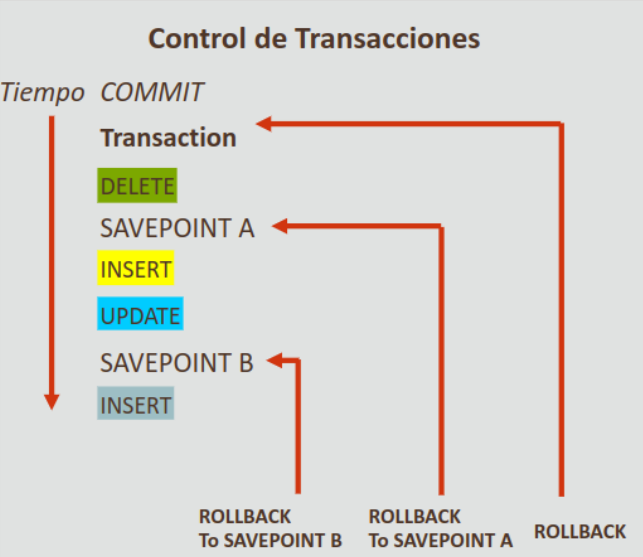

- [Volver al inicio](index.html)

## 18.1 Transacciones de Base de Datos
 
Desde una perspectiva de negocio, es importante para un negocio
mantener el control del flujo de procesamiento de sus 
transacciones. Imagine que un banco no tuviera ningún proceso
sistemático para registrar los retiros y depósitos, ¿cómo sabría 
si un depósito se ha abonado en su cuenta antes de que tenga que
retirar dinero? eso produciría una enorme confusión.

Afortunadamente, los bancos y otras instituciones controlan las
transacciones para garantizar la consistencia de los datos. En 
Oracle Server, estas se gestionan mediante las palabras 
reservadas `COMMIT`, `ROLLBACK` y `SAVEPOINT`. Estas sin embargo
no están soportadas por Oracle APEX debido a la forma en que 
este gestiona las conexiones de la BD.

### Transacciones

Las transacciones son un concepto fundamental de todos los SGBD.
Estas permiten a los usuarios realizar cambios a los datos y 
decidir si desean guardar o desechar el trabajo. **Con las 
transacciones se puede agrupar varios pasos en una unidad lógica 
de trabajo.**

Una transacción puede constar de:

- Sentencias DML que constituyen un cambio consistende de los datos (`INSERT`, `UPDATE`, `DELETE` y `MERGE`)
- Sentencias DDL como `CREATE`, `ALTER`, `DROP`, `RENAME` o `TRUNCATE`.
- Una sentencia DCL como `GRANT` o `REVOKE`.

#### Analogía de Transacción

La BD de un banco contiene saldos de varias cuentas de cliente,
así como saldos de depósitos totales para otras sucursales. 
Supongamos que un cliente desea retirar y transferir dinero de su
cuenta en una sucursal diferente. Hay varios independientes
implicados para lograr esta operación bastante sencilla. Las dos
sucursales bancarias desean asegurarse de que **se producen todos
los pasos de la transacción, o no se produce ninguno de ellos 
(así SI EL SISTEMA FALLA LA TRANSACCIÓN NO SE DEJA PARCIALMENTE
TERMINADA). Una transacción SE PRODUCE COMPLETAMENTE o NO SE 
PRODUCE EN LO ABSOLUTO.**

### Control de Transacciones

Las transacciones se controlan mediante:

- `COMMIT`: reperesenta el punto en el tiempo en que el usuario ha realizado
  todos los cambios que quería agrupar, **y como no se ha cometido ningún
  error, el usuario está listo para guardar el trabajo.**
  
- `ROLLBACK`: permite al usuario desechar los cambios realizados en la base de
  datos. **Cuándo se emite un ROLLBACK, se desechan todos los cambios
  pendientes.**

- `SAVEPOINT`: crea un marcador en una transacción, que divide la transacción
  en varias partes más pequeñas.
  
- `ROLLBACK TO SAVEPOINT`: permite al usuario realizar un `ROLLBACK` de la
  transacción actual hasta un punto de grabación especificado. **Si el usuario
  ha cometido un error, puede emitir una sentencia `ROLLBACK TO SAVEPOINT`
  desechando SÓLO LOS CAMBIOS REALIZADOS DESPUÉS DEL `SAVEPOINT`.**

### Ejemplo de Transacción

En el siguiente ejemplo, un usuario ha emitido una sentencia `UPDATE` e inmediatamente creado un `SAVEPOINT` llamado `one`:

~~~sql

-- estos cambios quedarán en el punto de guardado a continuación
UPDATE copy_employees
SET manager_id = 101
WHERE department_id = 60;

-- creando un punto de guardado
SAVEPOINT one;

-- estos cambios NO se incluyeron en el punto de guardado
INSERT INTO
  copy_departments(department_id, department_name, manager_id, location_id)
VALUES (130, 'Estate Manager', 102, 15000);

-- LA SIGUIENTE SENTENCIA ESTÁ MAL, OMITIÓ UNA CLÁUSULA WHERE
UPDATE copy_departments SET department_id = 140;

-- por suerte, el usuario se dio cuenta del error e hizo ROLLBACK
-- de la transacción al estado en SAVEPOINT one
ROLLBACK TO SAVEPOINT one;
-- ahora todos los cambios de ese UPDATE defectuoso desaparecieron
-- y la tabla copy_departments queda en el estado que se encontraba
-- al realizar el SAVEPOINT one
~~~

### ¿Cuándo empieza y Termina una Transacción?

En Oracle, una transacción empieza con la primera sentencia
DML y termina  cuando se produce una de las siguientes situaciones:

- Se emite una sentencia `COMMIT` o `ROLLBACK`
- Se emite una sentencia DDL
- Se emite una sentencia DCL
- Un usuario sale normalmente de la utilidad de la utilidad de base de datos
  Oracle, **LO QUE HACE QUE LA TRANSACCION ACTUAL SE CONFIRME DE FORMA
  IMPLÍCITA**

Tras finalizar una transacción, la siguiente sentencia SQL ejecutable inicia
automáticamente la próxima transacción. Una sentencia DDL o DCL además finaliza
implícita y automáticamente esa transacción **(esto quiere decir que sólo se
puede realizar una operación DDL o DCL por transacción antes de finalizarla).
TODOS LOS CAMBIOS DE DATOS REALIZADOS DURANTE LA TRANSACCIÓN SON TEMPORALES
HASTA QUE SE CONFIRMA LA TRANSACCIÓN.**

### Consistencia de los Datos

Imagine que usted y otra personas están trabajando al mismo tiempo en
actualizar la información de los empleados y al finalizar encontrara que la
otra persona está introduciendo información que ha entrado en conflicto con sus
cambios. Para evitar esas interrupciones y permitir que varios
usuarios accedan al mismo tiempo a la BD, se utiliza algo llamado
"consistencia de lectura".

#### Consistencia de Lectura

La consistencia de lectura garantiza una vista consistente de
los datos para todos los usuarios en todo momento; es decir, **que los lectores
no visualicen datos en proceso de cambio, y que se garantice a los escritores
que los cambios realizados en la base de datos se realizarán de forma
consistente, DE FORMA QUE LOS CAMBIOS REALIZADOS POR UN ESCRITOR NO DESTRUYAN NI ENTREN EN CONFLICTO CON LOS CAMBIOS REALIZADOS POR OTRO ESCRITOR.**

La consistencia de lectura se implementa de forma automática. Una copia parcial de la BD se mantiene en segmentos de deshacer.
Cuando el usuario A emite una operación DML en la BD, Oracle toma
una instantánea de los datos antes de cambiarlos y los escribe en un segmento
de deshacer (rollback). El usuario B sigue viendo la BD como existía antes de
que se iniciaran los cambios; ve la instantánia de los datos del segmento de
deshacer. **Antes de confirmar los cambios en la BD, SÓLO EL USUARIO QUE ESTÁ
CAMBIANDO LOS DATOS VE LOS CAMBIOS, todos los demás ven la instantánea en el
segmento de deshacer.**

### Cambios Visibles

Cuando se confirma una sentencia DML, cualquiera que ejecute la
sentencia `SELECT` puede ver el cambio realizado. Si se realiza
un `ROLLBACK` de la transacción, los cambios se deshacen. De este modo **la
versión original anterior de los datos del segmento de deshacer se vuelve a
escribir en la tabla, y todos los usuarios ven la BD como existía antes de
comenzar la transacción.**

### COMMIT, ROLLBACK y SAVEPOINT

Las palabras reservadas `COMMIT`, `ROLLBACK` y `SAVEPOINT` forman parte de lo
que se conoce como TCL (Transaction Control Language) que sirve para garantizar
la consistencia de los datos agrupando lógicamente las operaciones y
permitiendo previsualizar los cambios antes de confirmarlos, además de crear
puntos de control para el manejo de transacciones.

En la ilustración anterior, se puede apreciar la forma en que
una transacción opera regularmente. En este ejemplo específico se
emitió una sentencia `DELETE` y a continuación, se estableció un
`SAVEPOINT A`, este actúa como marcador para que el usuario pueda
realizar `ROLLBACK` de los cambios posteriores en los datos al
estado en el que dichos datos existían en ese punto.

En ese mismo ejemplo, después del `SAVEPOINT a` se realizan dor
operaciones `INSERT` y `UPDATE`, y se establece otro marcador de
rollback `SAVEPOINT B`. 

**Si el usuario no desea que se produzcan las sentencias `INSERT` y/o `UPDATE`,
puede emitir una sentencia `ROLLBACK TO SAVEPOINT A`.**

La adición de otros `SAVEPOINTS` crea otros marcadores para
puntos de rollback, aunque **si se emite una sentencia `ROLLBACK` sin `ROLLBACK TO SAVEPOINT`, SE FINALIZA TODA LA TRANSACCIÓN Y SE DESECHAN TODOS LOS CAMBIOS DE DATOS PENDIENTES.**

### Procesamiento de Transacciones Implícitas

Aparte de la confirmación automática de los cambios mencionada anteriormente,
Oracle produce un rollback automático se produce tras una terminación anormal
de la utilidad de base de datos Oracle o se produce un fallo del sistema. Esto
evita que cualquier error en los datos provoque cambios no deseados en las
tablas subyacentes y se protege la integridad de los datos.

# COMPLETAR
### Bloqueo

Es importante evitar que más de un usuario cambie la BD a la vez.  Oracle
utiliza bloqueos para evitar una interacción destructiva entre transacciones
que acceden al mismo recurso, tanto objetos de usuario (tablas, filas) como
ovjetos del sistema no visibles (como estructuras de datos compartidas y el
diccionario de datos).

El bloqueo de Oracle se realiza automáticamente; un bloque implícito se produce para sentencias SQL concorde sea necesario según la acción solicitada (estas son básicamente todas las
sentencias excepto `SELECT`).

Un usuario sin embargo también puede bloquear datos de nota manual, lo que se denomina bloque explícito. **Emitir una
sentencia `COMMIT` o `ROLLBACK` libera los bloqueos en las
filas afectadas.**