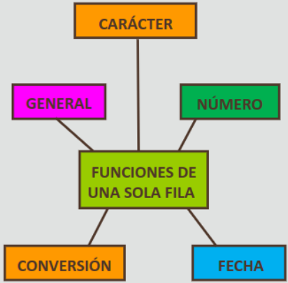

Oracle Academy: Database Programing with SQL, Parte 3

* [Volver al inicio](index.html)

- [3.1 Comparaciones Lógicas y Reglas de Prioridad](#31-comparaciones-lógicas-y-reglas-de-prioridad)
  - [Operador AND](#operador-and)
  - [Operador OR](#operador-or)
  - [Operador NOT](#operador-not)
  - [Reglas de prioridad](#reglas-de-prioridad)
- [3.2 Ordenación de Filas](#32-ordenación-de-filas)
  - [Cláusula ORDER BY](#cláusula-order-by)
  - [Orden Descendente](#orden-descendente)
  - [Uso de Aliases y Otras columnas](#uso-de-aliases-y-otras-columnas)
  - [Orden de Ejecución](#orden-de-ejecución)
  - [Ordenado con Varias Columnas](#ordenado-con-varias-columnas)
- [3.3 Introducción a las Funciones](#33-introducción-a-las-funciones)
  - [Funciones de una sola fila](#funciones-de-una-sola-fila)
  - [Funciones de varias filas](#funciones-de-varias-filas)
  
## 3.1 Comparaciones Lógicas y Reglas de Prioridad

En el mundo real hay multitud de escenarios en los que se requiere de chequear más de una condicion, y en el caso de SQL, siempre es aconsejable poder restringir las filas devueltas de esta manera. Puede ser que por ejemplo, un jefe de restaurante necesite determinar los nombres de los empleados que tomen pedidos o cocinen. Este tipo de solicitudes se pueden satisfacer con `AND`, `NOT` y `OR`.

Las condiciones lógicas combinan el resultado de dos condiciones de componentes para producir un único resultado según dichas condiciones. Sólo se retorna un resultado si el resultado global de todas las condiciones es verdadero o `TRUE`. Para cada condición individual:

* `AND` devuelve `TRUE` si **ambas condiciones son verdaderas.**
* `OR` devuelve `TRUE` si **alguna de las condiciones es verdadera.**
* `NOT` devuelve `TRUE` si **ninguna de las condiciones es verdadera.**

### Operador AND

Por ejemplo:

~~~sql
SELECT last_name, department_id, salary FROM employees WHERE department_id > 50 AND salary > 12000;
~~~

Retorna la lista de empleados y sus departamentos cuyo salario sea mayor a 12000$ y cuyo id sea mayor a 50, los cuales serían:

|LAST_NAME|DEPARTMENT_ID|SALARY|
|---|---|---|
|King|90|24000|   
|Kochhar|90|17000|   
|De Haan|90|17000|  

Los operadores lógicos se pueden utilizar con cláusulas y comparadores más complejos, por ejemplo:

~~~sql
SELECT last_name, hire_date, job_id FROM employees WHERE hire_date > '01-Jan-1998' AND job_id LIKE 'SA%';
~~~

Retorna los siguientes resultados:

|LAST_NAME|HIRE_DATE|JOB_ID|   
|---|---|---|   
|Zlotkey|29-Jan-2000|SA_MAN|   
|Taylor|24-Mar-1998|SA_REP|
|Grant|24-May-1999|SA_REP|   

### Operador OR

El operador `OR` funciona de forma similar, aunque la comparación es menos estricta que `AND`:  

~~~sql
SELECT department_name, manager_id, location_id FROM departments WHERE location_id = 2500 OR manager_id=124;
~~~

La sentencia anterior devuelve los siguientes resultados:

|DEPARTMENT_NAME|MANAGER_ID|LOCATION_ID|
|---|---|---|  
|Shipping|124|1500|  
|Sales|149|2500|

_Nótese los valores de LOCATION\_ID y MANAGER\_ID, aunque ambos resultados no coincidan con ambas sentencias, sólo basta con que cada uno cumpla parte del grupo de condiciones._

### Operador NOT

Este operador se usa para devolver las filas que **NO** coincidan con las condiciones establecidas en la cláusula `WHERE`:

~~~sql
SELECT department_name, location_id FROM departments WHERE location_id NOT IN (1700,1800);
~~~

La sentencia anterior devuelve:

|DEPARTMENT_ID|LOCATION_ID|
|---|---|  
|Shipping|1500|  
|IT|1400|  
|Sales|2500|  

### Reglas de prioridad

SQL cuenta con una serie de reglas básicas a la hora de resolver cláusulas que contienen comparaciones lógicas demasiado complejas. **El operador `AND` se evalúa primero que el operador `OR` y el operador `NOT` se desarrolla antes que `AND`**, y antes que estoss, les siguen las operaciones aritméticas, la concatenación, los comparadores matemáticos, la comprobación de nulos y los `BETWEEN`. El orden de prioridad es el siguiente (de mayor a menor, siendo 1 el más alto):

|ORDER|OPERATOR|  
|---|---|  
|1|Arithmetic + - * /|  
|2|Concatenatio \|\||  
|3|Comparasion (<,>,<=,>=,<>)|  
|4|IS (NOT) NULL, LIKE, (NOT) IN|  
|5|(NOT) BETWEEN|  
|6|NOT|  
|7|AND|  
|8|OR|

Por ejemplo, la siguiente sentencia:

~~~sql
SELECT last_name||' '||salary*1.05 AS "Employee Raise" FROM employees WHERE department_id IN(50,80) AND first_name LIKE 'C%' OR last_name LIKE '%s%';
~~~

Devuelve los siguientes valores:

|Employee Raise|DEPARTMENT_ID|FIRST_NAME|   
|---|---|---|   
|Higgins 12600|110|Shelley|   
|Mourgos 6060|50|Kevin|   
|Rajs 3675|50|Trenna|   
|Davies 3255|50|Curtis|   
|Matos 2730|50|Randal|   
|...|...|...|   
|...|...|...|   
|...|...|...|   

Los resultados devueltos podrían cambiar radicalmente con sólo unos cambios menores en la sentencia. Por ejemplo:

~~~sql
-- Invirtiendo el orden del AND y el OR
SELECT last_name||' '||salary*1.05 AS "Employee Raise" FROM employees WHERE department_id IN(50,80) OR first_name LIKE 'C%' AND last_name LIKE '%s%';
~~~

De esta forma se incluirían **los empleados que o estén en los departamentos 50 u 80 _o_ cuyo nombre empiece con C y contengan una s en el apellido.**

Los paréntesis también pueden utilizarse para alterar la jerarquía natural de estas operaciones:

~~~sql
-- Invirtiendo el orden del AND y el OR
SELECT last_name||' '||salary*1.05 AS "Employee Raise" FROM employees WHERE (department_id IN(50,80) OR first_name LIKE 'C%') AND last_name LIKE '%s%';
~~~

Ahora la cláusula OR será evaluada antes que el AND, por lo que esta sentencia devolverá **los empleados que o estén en los departamentos 50 u 80 _O_ cuyo nombre empiece con C, _Y ADEMÁS_ contengan una s en el apellido.**

## 3.2 Ordenación de Filas

Ordenar, agrupar y clasificar son acciones que facilitan la búsqueda de cosas en el mundo real, y SQL incorpora funciones para realizar estas tareas.
Durante la fase de diseño de la base de datos, las funciones de neogcio se ordenan por entidades y atributos, y en el caso de SQL existe la cláusula `ORDER BY`.

### Cláusula ORDER BY

Por defecto, `ORDER BY` ordena las filas devueltas en forma ascendente los resultados según las formas en que se especifique; esto es: **los números se muestran del menor al mayor, las fechas de la más antigua a la más reciente, y los caracteres en órden alfabético, ESTANDO LOS NULOS SIEMPRE AL FINAL.**

La cláusula `ORDER BY` siempre debe ir al final de cláusula `WHERE` y sólo puede haber un `ORDER BY` en toda la sentencia.

Por ejemplo, la siguiente sentencia ordena los resultados de forma ascendente por fecha de contratación:

~~~sql
SELECT last_name, hire_date, FROM employees ORDER BY hire_date;
~~~

|LAST_NAME|HIRE_DATE| 
|---|---| 
|King|17-Jun-1987| 
|Whalen|17-Sep-1987| 
|Kochhar|21-Sep-1989| 
|Hunold|03-Jan-1990| 
|...|...| 
|...|...| 
|...|...| 

### Orden Descendente

Se puede invertir el orden utilizado por defecto usando la palabra reservada `DESC`, **lo que ordena los valores de forma inversa a lo esperado por defecto (de forma descendente), ESTO UBICA LOS RESULTADOS NULOS AL PRINCIPO**. Alternativamente, **se puede especificar en qué orden se desea localizar los valores nulos mediante las palabras reservadas `NULL FIRST` (al principio) y `NULL LAST` (al final).**

~~~sql
SELECT last_name, hire_date FROM employees ORDER BY hire_date DESC;
~~~

|LAST_NAME|HIRE_DATE| 
|---|---| 
|Zlotkey|29-Jan-2000| 
|Mourgos|16-Nov-1999| 
|Grant|24-May-1999| 
|Lorentz|07-Feb-1999| 
|...|...| 
|...|...| 
|...|...| 

### Uso de Aliases y Otras columnas

`ORDER BY` permite el uso de aliases para ordenar los resultados, con la única condición que sea un alias usado en la misma cláusula `SELECT` que se está utilizando.

~~~sql
SELECT last_name, hire_date AS "Date Started", FROM employees ORDER BY hire_date;
~~~

|LAST_NAME|Date Started| 
|---|---| 
|King|17-Jun-1987| 
|Whalen|17-Sep-1987| 
|Kochhar|21-Sep-1989| 
|Hunold|03-Jan-1990| 
|...|...| 
|...|...| 
|...|...|

Por otra parte, también permite realizar **ordenación con otras columnas** diferentes a las utilizadas en la cláusula `SELECT`, con tal de que esta columna exista y sea inambigua en alguna de las tablas mencionadas en la sentencia (en el caso de que haya varias tablas en una misma sentencia).

~~~sql
SELECT employee_id, first_name FROM employees WHERE employee_id <105 ORDER BY last_name;
~~~

|EMPLOYEE_ID|FIRST_NAME|  
|---|---|  
|102|Lex|  
|104|Bruce|  
|103|Alexander|  
|100|Steven|  
|101|Neena|  

### Orden de Ejecución

En una sentencia SELECT las cláusulas se ejecutan de la siguiente forma:

* `FROM` busca las tabla que contiene los datos
* `WHERE` restringe las filas que se van a devolver
* `SELECT` selecciona el conjunto de datos de acuerdo a las columnas solicitadas.
* `ORDER` BY ordena el conjunto de resultados

### Ordenado con Varias Columnas

No hay ningún límite en el número de columnas que pueden agregarse a la cláusula `ORDER BY`. Las columnas se consideran de izquierda a derecha, y pueden utilizarse las palabras reservadas `DESC`, `NULL FIRST` y `NULL LAST` siempre que se encuentren al final de la cláusula. Por ejemplo:

~~~sql
SELECT department_id, last_name FROM employees WHERE department_id<=50 ORDER BY department id, last_name;
~~~

Da como resultado:

|DEPARTMENT_ID|LAST_NAME|  
|---|---|  
|10|Whalen|  
|20|Fay|  
|30|Hartstein|  
|50|Davies|  
|50|Matos|  
|50|Mourgos|  
|...|...|  
|...|...|  
|...|...|  

_Se puede observar que los empleados del departamento 50 están ordenados alfabéticamente por su apellido, de la misma forma que todos los empleados en general están ordenados por su departamento._

## 3.3 Introducción a las Funciones

En SQL se cuenta con lo que se denominan funciones, las cuales permiten transformar unos datos de entrada en otros datos diferentes, son pequeños programas que realizan una acción en un valor o columna y producen algo distinto como salida. Estas funciones se utilizan para manipular los valores de datos.

Todas las funciones tienen datos de entradas que se conocen como argumentos, y siempre producen una salida.

Existen dos tipos de funciones diferentes (en SQL) las cuales són

* **Funciones de una fila:** funcionan en una única fila y devuelven un sólo resultado por fila. Estas son funciones de caractér, número, fecha y conversiones entre estas.
* **Funciones de varias filas:** pueden manipular grupos de filas para proporcionar un resultado por grupo de filas (por eso también se les conoce como **funciones de grupo**).

### Funciones de una sola fila

_Ilustrando los distintos tipos de funciones de una sola fila que existen._

En SQL, las funciones de una sola fila se pueden utilizar para:

* Realizar cálculos como redondear números para una determinada posición decimal.
* Modificar elementos de datos individuales como la conversión de valores de caracteres de mayúsculas a minúsculas.
* Dar formato a fechas y números para su visualización, como convertir el formato de fecha de una base de datos numérico interno en un formato estándar.
* Convertir los tipos de dato de una columna, como la conversión  de una cadena de caracteres en un número o fecha.

Las funciones de una sola fila aceptan uno o más argumentos y devolverán un único resultado por fila. Por lo tanto, aplicar a 12 filas la misma función de una sola fila devolverá 12 resultados distintos.

### Funciones de varias filas

Las funciones de varias filas (o de grupo) toman muchas filas como entrada, y devuelven un valor único como salida. La entrada de filas puede ser toda la tabla o una tabla dividida en grupos más pequeños. Algunos ejemplos de funciones de grupo son:

* `MAX`: busca el valor más alto en un grupo de filas.
* `MIN`: busca el valor más bajo de un grupo de filas.
* `AVG`: busca el valor promedio de un grupo de filas.

