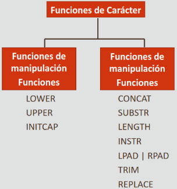
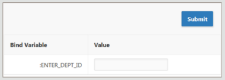

Oracle Academy: Database Programing with SQL, Parte 4

* [Volver al inicio](index.html)

- [4.1 Manipulación de Mayúsculas/Minúsculas y de Caracteres](#41-manipulación-de-mayúsculasminúsculas-y-de-caracteres)
  - [Tabla DUAL](#tabla-dual)
  - [Funciones de Caracteres de una sola fila](#funciones-de-caracteres-de-una-sola-fila)
    - [LOWER](#lower)
    - [UPPER](#upper)
    - [INITCAP](#initcap)
  - [Funciones de Manipulación de Caracteres](#funciones-de-manipulación-de-caracteres)
    - [CONCAT](#concat)
    - [SUBSTR](#substr)
    - [LENGTH](#length)
    - [INSTR](#instr)
    - [LPAD](#lpad)
    - [RPAD](#rpad)
    - [TRIM](#trim)
    - [REPLACE](#replace)
  - [Uso de Alias de Columna con Funciones](#uso-de-alias-de-columna-con-funciones)
  - [Variables de sustitución](#variables-de-sustitución)
- [4.2 Funciones Numéricas](#42-funciones-numéricas)
  - [ROUND](#round)
  - [TRUNC](#trunc)
  - [MOD](#mod)
- [4.3 Funciones de Fecha](#43-funciones-de-fecha)
  - [Visualización de fechas](#visualización-de-fechas)
  - [SYSDATE](#sysdate)
  - [Tipo de Dato DATE](#tipo-de-dato-date)
  - [Trabajar con Fechas](#trabajar-con-fechas)
  - [Funciones de Fecha](#funciones-de-fecha)
    - [MONTHS_BETWEEN](#months_between)
    - [ADD_MONTHS](#add_months)
    - [NEXT_DAY](#next_day)
    - [LAST_DAY](#last_day)
    - [ROUND](#round-1)
    - [TRUNC](#trunc-1)

## 4.1 Manipulación de Mayúsculas/Minúsculas y de Caracteres

Poder cambiar el formato en que se presentan los datos es una característica fundamental de los gestores de bases de datos. Muchas veces necesitamos cambiar la forma en que aparecen los datos según los requisitos de la tarea que estamos intentado lograr. El lenguaje SQL cuenta con diversas funciones de una sola fila destinadas para esta tarea.

### Tabla DUAL

Oracle cuenta con una tabla especial llamada `DUAL`, la cual está estructurada de la siguiente forma:

|DUMMY|
|---|
|x|

Esta tabla se utiliza para crear sentencias SELECT y ejecutar funciones que no estén directamente relacionadas con una tabla de base de datos concreta, ya que toda cláusula `SELECT` debe estar acompañada de una cláusula `FROM` (aunque no es el caso en todos los RDBMS).

Ya que todas las consultas a `DUAL` devuelven un solo resultado, esta es útil para realizar cálculos y evaluar expresiones que no derivan de una tabla, y es común utilizarla en funciones de una sola fila.

Por ejemplo:

~~~sql
SELECT (319/29)+12 FROM DUAL;
~~~

Devuelve:

|(319/29)+12|
|---|
|23|

### Funciones de Caracteres de una sola fila

_Enumerando todas las funciones de caractér disponibles en Oracle SQL._

Las funciones de caracteres de una fila se clasifican principalmente en:

* Las que convierten mayúsculas/minúsculas en cadenas de caracteres.
* Las que pueden unir, extraer, mostrar, encontrar, rellenar y recortar cadenas de caracteres.

**Estas funciones pueden utilizarse en las cláusulas `SELECT`, `WHERE` y `ORDER BY`.**

Las funciones de manipulación de mayúsculas/minúsculas son importantes **porque desde el punto de vista de la base de datos las mayúsculas y minúsculas son diferentes (por ejemplo, no es lo mismo una 'v' que una 'V')** y puede que no siempre se sepa cómo se han escrito los datos almacenados; con la manipulación de mayúsculas/minúsculas se puede convertir temporalmente los datos según se desee. Esto evita inconsistencias entre la redacción y las información guardada en las solicitudes realizadas a la base de datos. Con ellas se puede aplicar tanto formato a la salida como buscar cadenas específicas.

Estas funciones son:

#### LOWER

Convierte todos los caracteres alfabéticos en minúscula.

~~~sql
-- Se usa de la forma LOWER(columna|expresion)
SELECT last_name FROM employees WHERE LOWER(last_name) = 'abel';
~~~

#### UPPER

Convierte todos los caracteres alfabéticos en mayúscula.

~~~sql
-- Se usa de la forma UPPER(columna|expresion)
SELECT last_name FROM employees WHERE UPPER(last_name) = 'ABEL';
~~~

#### INITCAP

Convierte todos los caracteres alfabéticos en una expresión capitalizada (la primera letra de cada palabra en una mayúscula, el resto en minúsculas).

~~~sql
-- Se usa de la forma INITCAP(columna|expresion)
SELECT last_name FROM employees WHERE INITCAP(last_name) = 'Abel';
~~~

### Funciones de Manipulación de Caracteres

La funciones de manipulación de caracteres se utilizan para extraer, cambiar, formatear, o modificar de alguna forma una cadena de caracteres. A la función se le pasan uno o más caracteres o palabras, entonces esta realiza sus funciones en las cadenas de caracteres de entrada y devuelve el valor cambiado/extraído/contado/alterado.

Estas funciones son:

#### CONCAT

Une dos valores. Toma dos argumentos de cadena de caracteres y une la segunda cadena a la primera. Se comporta similar al operador `||` pero sólo recibe dos argumentos.

Ejemplo:

~~~sql
SELECT CONCAT(first_name,last_name) FROM employees;
~~~

Retorna

|CONCAT(first_name,last_name)|
|---|
|EllenAbel|
|CurtisDavies|
|...|

#### SUBSTR

Extrae una cadena de una longitud determinada.

Ejemplo:

~~~sql
-- Los argumentos son (cadena, posición inicial, longitud de la subcadena a extraer)
SELECT SUBSTR(last_name,1,3) FROM employees;
~~~

Retorna

|SUBSTR(last_name,1,3)|
|---|
|Abe|
|Dav|
|...|

Que en palabras simples sería: genere una subcadena con tres letras del apellido de todos los empleados empezando desde la primera.

**Si no se especifica una posición inicial (o sea, SÓLO SE LE ENTREGAN DOS ARGUMENTOS A LA FUNCIÓN) `SUBSTR` EMPIEZA A CONTAR A PARTIR DEL PRIMER CARACTÉR DE IZIQUIERDA A DERECHA. El SEGUNDO ARGUMENTO REPRESENTA LA LONGITUD DE LA SUBCADENA A EXTRAER**

Ejemplo:

~~~sql
-- El sexto caractér de esta expresión sería la W.
SELECT SUBSTR('HelloWorld',6) FROM DUAL;
~~~

Retorna

|SUBSTR('HelloWorld',6)|
|---|
|World|

**Se pueden utilizar valores negativos como posiciones inicales para la función `SUBSTR`, en cuyo caso empezaría a substraer los caracteres desde el n-ésimo caracter CONTANDO DE DERECHA A IZQUIERDA.**

* Referencia: https://docs.oracle.com/cd/B19306_01/server.102/b14200/functions162.htm

#### LENGTH

Muestra la longitud de una cadena como un valor numérico. La función toma una cadena de caracteres como argumento y devuelve el número de caracteres en esta.

Ejemplo:

~~~sql
SELECT LENGTH(last_name) FROM employees;
~~~

Retorna

|LENGTH(last_name)|
|---|
|4|
|6|
|...|

#### INSTR

Encuentra la posición numérica de los caracteres especificados.
Busca la primera incidencia de una subcadena dentro de una cadena de
caracteres y devuelve la posición como un número, **si no la encuentra,
devuelve 0.**

Por ejemplo:

~~~sql
SELECT last_name, INSTR(last_name,'a') FROM employees;
~~~

Retorna:

|last_name|INSTR(last_name,'a')|
|---|---|
|Abel|0|
|Davies|2|

_Nótese que la A mayúscula en Abel no cuenta para INSTR ya que la base de datos es sensible a la diferencia entre mayúsculas y minúsculas._

#### LPAD

Rellena la parte izquierda de una cadena de caracteres, justificando el valor hacia la derecha.

  ~~~sql
  -- Se necesitan tres argumentos: la cadena de caracteres, el número total de caracteres
  -- que se espera que tenga el resultado final y el caracter específico con que se desea justificar
  SELECT LPAD(last_name,10,'*') FROM employees;
  ~~~

  |LPAD(last_name,10,'*')|
  |---|
  |******Abel|
  |****Davies|
  |...|

  _Se han agregado suficientes `*` a la izquierda de la primera letra de cada apellido para que al final ambas cadenas de caracteres
  tengan una longitud de 10._

#### RPAD

Rellena la parte derecha de una cadena de caracteres, dando lugar a un valor justificado a la izquierda.

~~~sql
-- Los argumentos son los mismos que para LPAD.
SELECT RPAD(last_name,10,'*') FROM employees;
~~~

|RPAD(last_name,10,'*')|
|---|
|Abel******|
|Davies****|

_El principio es el mismo detrás de LPAD, sólo que los caracteres ahora se ponen al final del apellido._

#### TRIM

Elimina todos los caracteres especificados, ya sea del principio o del final, o de ambos de una cadena. Existen varias formas de utilizar TRIM:

~~~sql
-- Elimina ocurrencias de un caracter al principio de una cadena,
-- o yendo de izquierda a derecha.
SELECT TRIM(LEADING 'a' FROM 'abcba') FROM DUAL;
--- Esto da como resultado la cadena 'bcba'
~~~

~~~sql
-- Elimina ocurrencias de un caracter al final de una cadena,
-- o yendo de derecha a izquierda.
SELECT TRIM(TRAILING 'a' FROM 'abcba') FROM DUAL;
--- Esto da como resultado la cadena 'abcb'
~~~

~~~sql
-- Elimina ocurrencias de un caracter tanto al principio
-- como al final de una cadena.
SELECT TRIM(BOTH 'a' FROM 'abcba') FROM DUAL;
--- Esto da como resultado la cadena 'bcb'
~~~

#### REPLACE

Sustituye una secuencia de caracteres de una cadena por otro juego de caracteres. Tiene una sintaxis como est:

~~~sql
-- string1: cadena cuyos caracteres se sustituirán
-- string_to_replace: la cadena que se buscará en string1
-- replacement_string: la cadena que va a reemplazar a string_to_replace.
REPLACE (string1, string_to_replace, [replacement_string]);
~~~

Por ejemplo:

~~~sql
SELECT REPLACE(last_name,'a','*') FROM employees;
~~~

Devuelve:

|REPLACE(last_name,'a','*')|
|---|
|Abel|
|D*vies|
|De H**n|

### Uso de Alias de Columna con Funciones

Todas las funciones actúan sobre los valores que tienen como argumentos, y cada nombre de función indica para qué sirven. Se puede utilizar aliases sobre las funciones para asignarles un nombro de columna en la salida.

Por ejemplo, a esta consulta:

~~~sql
SELECT LOWER(last_name)||LOWER(SUBSTR(first_name,1,1)) AS "User Name" FROM employees;
~~~

Le correponden los siguientes resultados:

|User Name|
|---|
|abele|
|daviesc|
|de haanl|

El alias "User Name" ha sustituído el nombre de la columna. Si no se hubiera especificado un alias, la salida de la misma consulta sería:

|LOWER(last_name)\|\|LOWER(SUBSTR(first_name,1,1))|
|---|
|abele|
|daviesc|
|de haanl|

### Variables de sustitución

En ocasiones, es posible que se necesite ejecutar la misma consulta con muchos valores defirentes para obtener distintos conjuntos de resultados. Por ejemplo, para escribir un informe de los departamentos de una empresa y sus empleados, pero un departamento a la vez. Las variables de sustitución nos sirven para evitar la tarea de editar la misma sentencia varias veces para cada cláusula `WHERE`.

**Las variables de sustitución son un mecanismo exclusivo de Oracle APEX.** Para usarlas, sólo se necesita sustituir el valor codificado en la sentecia con un `:named_variable`. Oracle APEX solicitará un valor al ejecutar la sentencia.

Por ejemplo, la siguiente consulta:

~~~sql
SELECT first_name, last_name, salary, department_id FROM employees WHERE department_id=10;
~~~

Reescrita para utilizar una variable de sustitución sería así:

~~~sql
-- Especial atención a lo que va después del WHERE
SELECT first_name, last_name, salary, department_id FROM employees WHERE department_id=:enter_dept_id;
~~~
El `:` es un "bit mágico" que Oracle APEX reconozca el texto que le sigue como la solicitud de una variable.

_Ejemplo de una ventana emergente de Oracle APEX tratando de ejecutar una consulta con una variable de sustitución. Los elementos emergentes deben estar habilitados para que este diálogo funcione._

Todos los argumentos recibidos por este diálogo son considerados cadenas de caracteres y se convierten en los tipos de datos requeridos por la consulta durante la ejecución, por lo que no es necesario usar comillas simples alrededor de las fechas o las cadenas de caracteres.

## 4.2 Funciones Numéricas

SQL cuenta con algunas funciones para procesar números en respuesta a escenarios del mundo real en que una base de datos tendría que enfrentarse a problemas de precisión, como un banco ajustando el tipo de interés según diversos indicadores económicos, que se hace en forma de valores porcentuales como 3,45%. Podría ser necesario redondar dicho porcentaje a 3.5%, o a 3%. Este truncado y/o redondeo juega un papel importante en los negocios y las BBDD que los soportan.

Dichas funciones son:

### ROUND

Puede utilizarse tanto en números como en fechas, principalmente sirve para redondear números a otro número especificado de posiciones decimales, o redondear números a la izquierda de la coma decimal. Su sintaxis es:

~~~sql
ROUND(<columna>|<expresion>, cifras decimales)
~~~

**EL PUNTO ES UTILIZADO POR DEFECTO COMO INDICADOR DE LA COMA DECIMAL. Si no se especifica un número de cifras decimales, o si este es cero, entonces el número se redondea a una cifra sin decimales.**

Es lo mismo decir `ROUND(45.926,0)` que `ROUND(45.926)`, eso da igual a `46`.

Un número positivo de posiciones decimales hace que la función redondee el número para que tenga esa cantidad de cifras a la derecha de la coma decimal.

~~~sql
ROUND(45.926,2)
-- Esto devuelve 45.93, que posee .93 como sus dos cifras decimales y además
-- es el número de dos cifras más cercano a .926.
~~~

~~~sql
ROUND(45.926,-1)
-- Esto devuelve 50, porque 5 es la primera unidad que se encuentra a la
-- izquierda de la coma decimal en el número '45.926'
~~~

### TRUNC

Esta función también puede utilizarse tanto en números como en fechas. Sirve para terminar la columna, valor o expresión especificada en un número especificado de posiciones decimales. Su sintaxis es parecida a la de `ROUND`:

~~~sql
TRUNC (<columna>|<expresion>, cifras decimales)
~~~

**Al igual que con `ROUND`, SI NO SE ESPECIFICA UN SEGUNDO ARGUMENTO EN LA FUNCIÓN, SE ASUME QUE ES 0**

**`TRUNC` NO REDONDEA EL NÚMERO ESPECIFICADO, SIMPLEMENTE CORTA EL EXCEDENTE PARA QUE EL RESULTADO SE AJUSTE A LAS CIFRAS DEFINIDAS**

~~~sql
TRUNC(45.926,2)
-- Esto da como resultado 45.92, se ha cortado .006 para que el número final
-- quedara con dos cifras decimales.
~~~

También se puede utilizar valores negativos en `TRUNC`, en cuyo caso intentará "recortar" las cifras que se encuentren a la izquierda de la coma decimal, por ejemplo:

~~~sql
TRUNC(15.79,-1)
-- Esto devuelve 10 como resultado, ha "recortado" el 5 porque
-- se le indicó que la primera cifra a la izquierda de la coma decimal era un excedente.
~~~

Referencia: https://docs.oracle.com/cd/B19306_01/server.102/b14200/functions200.htm

### MOD

Encuentra el resto después de que un valor sea dividio en otro valor, equivalente al operador `%` presente en muchos lenguajes de programación. Es comúnmente utilizado para determinar si un número es par o no (el módulo entre cualquier número par y el 2 siempre es cero).

## 4.3 Funciones de Fecha

Oracle, al igual que otros RDBMS, internamente almacena las fechas en la BBDD como números, por lo que es posible utilizar operadores matemáticos para realizar cálculos matemáticos e incluso algunas funciones numéricas de una sola fila. Dicha funcionalidad es importante para las organizaciones ya que les sirve para planificar procesos como la generación de nóminas y pagos, hacer seguimiento de las revisiones de rendimiento y los años de servicio, pedidos y envíos, entre otros.

### Visualización de fechas

Por defecto, las fechas se visualizan y se espera que sean ingresadas en el formato `DD-Mon-YYYY` (por ejemplo, `02-Dec-2014`).
Oracle puede almacenar una fecha que se encuentre entre el 1 de Enero de 4172 A.C. y el 31 de Diciembre de 9999 D.C.

### SYSDATE

`SYSDATE` es una función de fecha que **devuelve la fecha y hora actuales DEL SERVIDOR DONDE ESTÁ EJECUTÁNDOSE LA BASE DE DATOS.**

~~~sql
SELECT SYSDATE FROM DUAL;
~~~

|SYSDATE|
|---|
|09-Jul-2021|

### Tipo de Dato DATE

El tipo de dato `DATE` utiliza internamente cuatro dígitos para almacenar el año: dos para el siglo y dos para el año (or ejemplo, dos años se almacenarían como 1996 y 2004, no 96 ni 04) sin embargo, en versiones antiguas el componente del siglo no solía mostrarse por defecto.

### Trabajar con Fechas

Algunos ejemplos prácticos de lo que se puede hacer con las fechas son:

~~~sql

-- Agregar 60 días a la fecha de contratación de un empleado
SELECT last_name, hire_date + 60 FROM employees;

-- Mostrar el número de semanas que ha trabajado un empleado
-- desde que se contrató
SELECT last_name, (SYSDATE - hire_date)/7 FROM employees;

-- Mostrar la cantidad de años que un empleado trabajó en una
-- empresa. Como las operaciones entre fechas regresan días,
-- por eso necesita dividir el resultado de ambas operaciones
-- entre los 365 días de un año
SELECT employee_id, (end_date - start_date)/365 AS "Tenure in last job" FROM job_history;
~~~

### Funciones de Fecha

Oracle posee varias funciones específicas para operar entre fechas, todas devuelven valores de tipo `DATE` excepto `MONTHS_BETWEEN` (devuelve un número).

#### MONTHS_BETWEEN

Toma dos argumentos `DATE` y devuelve el número de meses de calendario entre las fechas. Si el primer argumento es una fecha anterior a la segunda, devuelve un valor negativo.

Ejemplo:

~~~sql
SELECT last_name, hire_date FROM employees WHERE MONTHS_BETWEEN(SYSDATE,hire_date)>240;
~~~

Esa sentencia devuelve:

|last_name|hire_date|
|---|---|
|King|17-Jun-1987|
|Kochhar|21-Sep-1989|
|De Haan|13-Jan-1993|
|...|...|

#### ADD_MONTHS

Toma dos argumentos, una fecha y un número. Devuelve un valor de fecha con el argumento numérico agregado al componente mensual de la fecha.

Ejemplo:

~~~sql
SELECT ADD_MONTHS('09-Jul-2021',12) AS "Next Year" FROM DUAL;
-- Devuelve '09-Jul-2022'
~~~

#### NEXT_DAY

Toma dos argumentos, una fecha y un día de la semana y devuelve la fecha de la siguiente incidencia de ese día de la semana después del argumento `DATE`.

Por ejemplo:

~~~sql
SELECT NEXT_DAY('09-Jul-2021','Sunday') AS "Next Sunday" FROM DUAL;
-- Devuelve '11-Jul-2021'
~~~

#### LAST_DAY

Toma un argumento `DATE` y devuelve la fecha del último día del mes del argumento `DATE`.

~~~sql
SELECT LAST_DAY('05-Jul-2015') AS "End Of The Month" FROM DUAL;
-- Devuelve 31-Jul-2015
~~~

#### ROUND

Devuelve una fecha redondeada a la unidad especificada en el segundo argumento:

~~~sql
SELECT hire_date, ROUND(hire_date,'Month') AS "A mes" FROM employees WHERE department_id=50;
~~~

Retorna:

|hire_date|A mes|
|---|---|
|16-Nov-1999|01-Dec-1999|
|17-Oct-1995|01-Nov-1995|
|29-Jan-1997|01-Feb-1997|

~~~sql
SELECT hire_date, ROUND(hire_date,'Year') AS "A año" FROM employees WHERE department_id=50;
~~~

Devuelve:

|hire_date|A año|
|---|---|
|16-Nov-1999|01-Jan-2000|
|17-Oct-1995|01-Jan-1996|
|29-Jan-1997|01-Jan-1998|

#### TRUNC

Devuelve una fecha truncada a la unidad especificada en el segundo argumento.

~~~sql
SELECT hire_date, TRUNC(hire_date,'Month') AS "A mes" FROM employees WHERE department_id=50;
~~~

Retorna:

|hire_date|A mes|
|---|---|
|16-Nov-1999|01-Nov-1999|
|17-Oct-1995|01-Oct-1995|
|29-Jan-1997|01-Jan-1997|

~~~sql
SELECT hire_date, TRUNC(hire_date,'Year') AS "A año" FROM employees WHERE department_id=50;
~~~

Devuelve:

|hire_date|A año|
|---|---|
|16-Nov-1999|01-Jan-1999|
|17-Oct-1995|01-Jan-1995|
|29-Jan-1997|01-Jan-1997|

Un ejemplo práctico en el se utilizan varias funciones de fecha en una misma consulta:

~~~sql
SELECT employee_id, hire_date, ROUND(MONTHS_BETWEEN(SYSDATE, hire_date)) AS TENURE, ADD_MONTS(hire_date,6) AS REVIEW, NEXT_DAY(hire_date, 'FRIDAY'), LAST_DAY(hire_date) FROM employees WHERE MONTHS_BETWEEN (SYSDATE,hire_date)>36;
~~~

La cual arroja 20 filas, entre las que se encuentran:

|EMPLOYEE_ID|HIRE_DATE|TENURE|REVIEW|NEXT_DAY(HIRE_DAY),'FRIDAY'|LAST_DATE(HIRE_DATE)|
|---|---|---|---|---|---|
|100|17-Jun-1987|384|17-Dec-1987|19-Jun-1987|30-Jun-1987|
|101|21-Sep-1989|321|21-Mar-1990|22-Sep-1989|30-Sep-1989|
|102|13-Jan-1993|281|13-Jul-1993|15-Jan-1993|31-Jan-1993|
|200|13-Sep-1987|345|17-Mar-1988|18-Sep-1987|30-Sep-1987|
|205|07-Jun-1994|265|07-Dec-1994|10-Jun-1994|30-Jun-1994|
|...|...|...|...|...|...|
|...|...|...|...|...|...|
