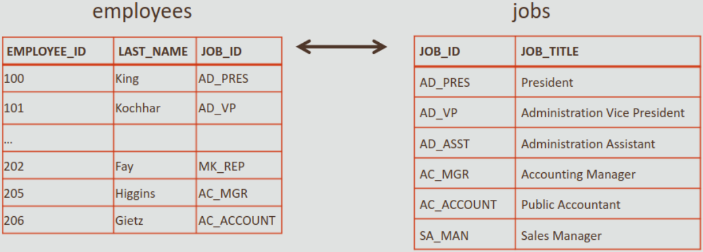
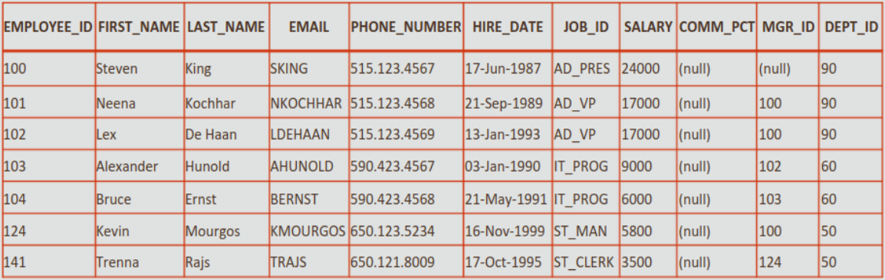
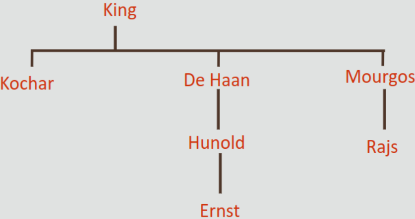
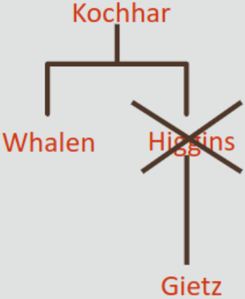
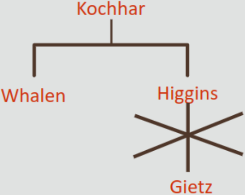

Oracle Academy: Database Programing with SQL, Parte 6

* [Volver al inicio](index.html)

- [6.1 Uniones Cruzadas y Uniones Naturales](#61-uniones-cruzadas-y-uniones-naturales)
  - [Comandos de Unión](#comandos-de-unión)
  - [ANSI](#ansi)
  - [SQL](#sql)
  - [Unión Natural](#unión-natural)
  - [CROSS JOIN](#cross-join)
- [6.2 Cláusulas JOIN](#62-cláusulas-join)
  - [Cláusula USING](#cláusula-using)
  - [Cláusula ON](#cláusula-on)
  - [Cláusula ON con Operador Distinto De](#cláusula-on-con-operador-distinto-de)
  - [Unión de Tres Tablas](#unión-de-tres-tablas)
- [Uniones Internas frente a Externas](#uniones-internas-frente-a-externas)
  - [Uniones Externas Izquierdas y Derechas](#uniones-externas-izquierdas-y-derechas)
  - [Union Externa Completa](#union-externa-completa)
- [6.4 Autouniones y Consultas Jerárquicas](#64-autouniones-y-consultas-jerárquicas)
  - [Consultas Jerárquicas](#consultas-jerárquicas)
  - [Palabras Clave de las Consultas jerárquicas](#palabras-clave-de-las-consultas-jerárquicas)
  - [Ejemplo de LEVEL en Consultas Jerárquicas](#ejemplo-de-level-en-consultas-jerárquicas)
  - [Informe de Consulta Jerárquica](#informe-de-consulta-jerárquica)
  - [Consulta Jerárquica de Abajo a Arriba](#consulta-jerárquica-de-abajo-a-arriba)
  - [Depuración de Consultas Jerárquicas](#depuración-de-consultas-jerárquicas)

## 6.1 Uniones Cruzadas y Uniones Naturales

Hasta ahora, las consultas utilizadas han trabajado sobre una tabla, pero las bases de datos reales contienen múltiples de ellas. Una de las prioridades que surgen durante el diseño y se materializa en el modelo final de las BBDD es que las tablas individuales sean capaces de asociarse entre sí. Sacando provecho de esto, SQL proporciona condiciones de unión que permiten consultar la información de distintas tablas y combinarlas en un informe.

### Comandos de Unión

Oracle Server cuenta con dos juegos de comandos o sintaxis para realizar conexiones entre las tablas de una BD: las uniones del estándar ANSI/ISO SQL 99 y sus propias extensiones propiedad de Oracle.

### ANSI

La ANSI _(American National Standards' Instituty)_ fue fundada en 1918, y es una organización privada sin ánimo de lucro que administra y coordina el sistema de evaluación de conformidad y estandarización voluntaria de EE.UU. Su misión es la de mejorar la competitividad global de los negocios estadounidenses como su calidad de vida, ya que promociona y facilita los estándares de conformidad voluntaria y los sistemas de evaluación de conformidad, así como proteger su integridad.

### SQL

Como ya se había mencionado antes, el lenguaje de consulta estructurado SQL se usa para interactuar con un RDBMS, Es el estándar del sector en el procesamiento de información en estos sistemas. Fue diseñado originalmente por IBM a mediados de 1970, se empezó a generalizar en los 80 y se convirtió en un estándar en 1986, cuando fue adoptado por la ANSI. Hasta ahora, han habido 4 iteraciones del estándar, cada una de ellas basada en la anterior y denominada por el año en que salió: ANSI-86, ANSI-92 y ANSI-99.

### Unión Natural

Una cláusula de unión SQL combina campos de 2 o más tablas en una BBDD relacional.

Una unión natural se basa en todas las columnas de dos tablas que tengan el mismo nombre y selecciona las filas de las dos tablas que tengan valores equivalentes en todas las columnas coincidentes. Por ejemplo:

Las siguientes tablas

La tabla `employees` tiene una referencia a la tabla `jobs` mediante el campo `JOB_ID`.

**CUANDO SE UTILIZA UNA UNIÓN NATURAL, es posible unir las tablas sin especificar de forma explícita las columnas de la tabla correspondiente, pero LOS NOMBRES Y LOS TIPOS DE DATOS DE AMBAS COLUMNAS DEBEN SER LOS MISMOS.**

Por ejemplo:

~~~sql
SELECT first_name, last_name, job_id, job_title FROM employees NATURAL JOIN jobs WHERE department_id>80;
~~~

La siguiente unión devolverá las columnas de la tabla `employees` y sus valores `job_title` relacionados de la tabla `jobs` en función del valor `job_id` de la columna común entre ambas tablas. Así:

|FIRST_NAME|LAST_NAME|JOB_ID|JOB_TITLE|
|---|---|---|---|
|Steven|King|AD_PRES|President|
|Neena|Kochhar|AD_VP|Administration Vice President|
|Lex|De Haan|AD_VP|Administration Vice President|
|Shelley|Higgins|AC_MGR|Accounting Manager|
|William|Gietz|AC_ACCOUNT|Public Accountant|

Aquí se muestra otro ejemplo práctico:

~~~sql
SELECT department_name, city FROM departments NATURAL JOIN locations;
~~~

Que resulta en la siguiente salida:

|DEPARTMENT_NAME|CITY|
|---|---|
|Marketing|Toronto|
|Sales|Oxford|
|IT|Southlake|
|Shipping|South San Francisco|
|Administration|Seattle|
|Executive|Seattle|
|Accounting|Seattle|
|Contracting|Seattle|

Esto funciona porque entre `departments` y `locations` hay una columna en común, `locations_id`. Cabe resaltar que no se necesita que la columna donde se hace la unión natural aparezca en la cláusula `SELECT`.

### CROSS JOIN

La cláusula `CROSS JOIN` es propia del estándar ANSI/ISO SQL99, y une cada fila de una tabla a cada fila de la otra tabla. El juego resultante representa todas las posibles combinaciones de filas de las dos tablas, el cual podría ser MUY grande (combinar 20 filas con una tabla con 100 filas arroja un total de 2000 combinaciones posibles).

Por ejemplo, tomemos la tabla `employees` que tiene 20 filas y la de `departments` que tiene 8 filas. Un `CROSS JOIN` entre ambas devolvería 160 filas, y se vería de esta forma:

~~~sql
SELECT last_name, department_name FROM employees CROSS JOIN departments;
~~~

Y devolvería algo parecido a esto:

|LAST_NAME|DEPARTMENT_NAME|
|---|---|
|Abel|Administration|
|Davies|Administration|
|De Haan|Administration|
|Ernst|Administration|
|Fay|Administration|
|Fay|Administration|
|Gietz|Administration|
|Grant|Administration|
|Hartstein|Administration|
|Higgins|Administration|

## 6.2 Cláusulas JOIN

### Cláusula USING

En una unión natural, si las tablas tienen columnas con los mismos nombres, pero diferentes tipos de datos, la unión podría provocar un error. Para evitar esta situación, la cláusula `USING` puede utilizarse para especificar qué columnas pueden utilizarse para la unión.

El siguiente es un ejemplo de su uso:

~~~sql
SELECT first_name, last_name, department_id, department_name FROM employees JOIN departments USING (department_id);
~~~

Lo cual devolvería

|FIRST_NAME|LAST_NAME|DEPARTMENT_ID|DEPARTMENT_NAME|
|---|---|---|---|
|Jennifer|Whalen|10|Administration|
|Michael|Hartstein|20|Marketing|
|Pat|Fay|20|Marketing|
|...|...|...|...|

Una de las ventajas que tiene la cláusula USING es que permite utilizar cláusulas `WHERE` en las sentencias con `NATURAL JOIN` para limitar las filas de una o de ambas tablas. Siguiendo el ejemplo anterior, pero ahora con una salvedad más:

~~~sql
SELECT first_name, last_name, department_id, department_name FROM employees JOIN departments USING (department_id) WHERE last_name='Higgins';
~~~

El resultado sería:
|FIRST_NAME|LAST_NAME|DEPARTMENT_ID|DEPARTMENT_NAME|
|---|---|---|---|
|Shelley|Higgins|110|Accounting|

### Cláusula ON

Para casos que `USING` no puede cubrir, como tratar de unir columnas con nombres diferentes, o bien si la unión utiliza operadores de comparación diferentes a `=`, existe la cláusula `ON`. Además de eso, también permite limitar las filas de una tabla utilizando `WHERE`.

Un ejemplo del uso de ON es:

~~~sql
SELECT last_name, job_title, FROM employees E JOIN jobs J ON (E.job_id=J.job_id);
~~~

Esto arrojaría como resultado:

|LAST_NAME|JOB_TITLE|
|---|---|
|King|President|
|Kochhar|Administration Vice President|
|De Haan|Administration Vice President|
|Whalen|Administration Assistant|
|Higgins|Accounting Manager|
|Gietz|Public Accountant|
|...|...|
|...|...|

Un concepto nuevo al que se llega con la cláusula `ON` son los **aliases de tabla**. Nótese como a la tabla `jobs` se le asignó el alias `J` y a employees el alias `E`. Esto es necesario porque **si se unen dos tablas utilizando `ON`, para el motor no existe forma de deducir de cuál tabla proviene cuál columna**, esto genera un error.

El siguiente es un ejemplo de la misma consulta, pero con una cláusula `WHERE`:

~~~sql
SELECT last_name, job_title, FROM employees E JOIN jobs J ON (E.job_id=J.job_id) WHERE last_name LIKE 'H%';
~~~

Esto arrojaría como resultado:

|LAST_NAME|JOB_TITLE|
|---|---|
|Higgins|Accounting Manager|
|Hunold|Programmer|
|Hartstein|Accounting Manager|

### Cláusula ON con Operador Distinto De

A veces puede hacer falta recuperar datos de una tabla que no tenga ninguna columna correspondiente en la otra tabla. Por ejemplo, suponga que desea conocer el valor `grade_level` para el salario de cada empleado. La tabla `job_grades` no tiene una columna común con la tabla `employees`. Aún así, `ON` puede unir ambas tablas. Por ejemplo:

~~~sql
SELECT last_name, salary grade_level, lowest_sal, highest_sal FROM employees JOIN job_grades ON (salary BETWEEN lowest_sal AND highest_sal);
~~~

Esa consulta devolvería:

|LAST_NAME|SALARY|GRADE_LEVEL|LOWEST_SAL|HIGHEST_SAL|
|---|---|---|---|---|
|Vargas|2500|A|1000|2999|
|Matos|2600|A|1000|2999|
|Davies|3100|B|3000|5999|
|Rajs|3500|B|3000|5999|
|Lorentz|4200|B|3000|5999|
|Whalen|4400|B|3000|5999|
|Mourgos|5800|B|3000|5999|
|Fay|6000|C|6000|9999|

### Unión de Tres Tablas

Tanto USING como ON se pueden utilizar para unir más de dos tablas. Supongamos que necesitamos un informe de nuestros empleados, su departamento y la ciudad de ese departamento. Eso involucra tres tablas: `employees`, `departments` y `locations`.

La sentencia para hacer eso sería la siguiente;

~~~sql
SELECT last_name, department_name AS "Department", city FROM employees JOIN departments USING (department_id) JOIN locations USING(location_id);
~~~

Eso daría como resultado:

|LAST_NAME|Department|CITY|
|---|---|---|
|Harstein|Marketing|Toronto|
|Fay|Marketing|Toronto|
|Zlotkey|Sales|Oxford|
|Abel|Sales|Oxford|
|Taylor|Sales|Oxford|
|Hurnold|IT|Southlake|
|Ernst|IT|Southlake|
|Lorentz|IT|Southlake|
|Mourgos|Shipping|South San Francisco|

## Uniones Internas frente a Externas

A veces existen casos en que deseamos recuperar tanto los datos que cumplan con la condición de unión como los que NO lo hagan.

Las uniones externas son parte del estándar ANSI/ISO-99 SQL, y sirven para realizar esta tarea.

Para el estándar, una unión de dos o más tablas que devuelven sólo las filas coincidentes se denomina unión interna, en caso contrario (que retornen filas que NO coincidan) se conoce **como unión externa**. Existen tres tipos de unión externa: **izquierda, derecha y completa.**

### Uniones Externas Izquierdas y Derechas

En el siguiente ejemplo:

~~~sql
SELECT e.last_name, d.department_id, d.department_name FROM employees e LEFT O
UTER JOIN departments d ON (e.department_id=d.department_id);
~~~

Con **la tabla izquierda ENTENDEMOS LA TABLA QUE SE ENCUENTRA EN LA PARTE IZQUIERDA DE LA CLÁUSULA `LEFT OUTER JOIN`.**

La sentencia anterior devuelve el siguiente resultado:

|LAST_NAME|DEPT_ID|DEPT_NAME|
|---|---|---|---|
|Whalen|10|Administration|
|Fay|20|Marketing|
|...|||
|Zlotkey|80|Sales|
|De Haan|90|Excecutive|
|Kochhar|90|Excecutive|
|King|90|Excecutive|
|Gietz|110|Accounting|
|Higgins|110|Accounting|
|Grant|-|-|

Por otra parte, este ejemplo devuelve todos los IDs de departamento y sus nombres, tanto de aquellos que tengan empleados como los que no.

~~~sql
SELECT e.last_name, d.department_id, d.department_name FROM employees e RIGHT OUTER JOIN departments d ON (e.department_id=d.department_id);
~~~

Con **la tabla izquierda ENTENDEMOS LA TABLA QUE SE ENCUENTRA EN LA PARTE DERECHA DE LA CLÁUSULA `LEFT OUTER JOIN`.**

La sentencia anterior devuelve el siguiente resultado:

|LAST_NAME|DEPT_ID|DEPT_NAME|
|---|---|---|---|
|Whalen|10|Administration|
|Fay|20|Marketing|
|...|||
|King|90|Excecutive|
|Kochhar|90|Excecutive|
|De Haan|90|Excecutive|
|Higgins|110|Accounting|
|Gietz|110|Accounting|
|-|190|Contracting|

### Union Externa Completa

Se puede crear una condición de unión para recuperar todas las filas coincidentes y todas las filas no coincidentes de ambas tablas, a través de una unión externa completa; esta combina tanto los resultados de un `LEFT OUTER JOIN` como de un `RIGHT OUTER JOIN`. Al ejemplo de la sección anterior, se le puede reescribir como una consulta que se comporte así con la cláusula `FULL OUTER JOIN`.

~~~sql
SELECT e.last_name, d.department_id, d.department_name FROM employees e FULL OUTER JOIN departments d ON (e.department_id=d.department_id);
~~~

La sentencia anterior devuelve el siguiente resultado:

|LAST_NAME|DEPT_ID|DEPT_NAME|
|---|---|---|---|
|King|90|Excecutive|
|Kochhar|90|Excecutive|
|...|||
|Taylos|80|Sales|
|Grant|-|-|
|Mourgos|50|Shopping|
|...|||
|Fay|20|Marketing|
|-|190|Contracting|

* Caso práctico: crear una unión para mostrar un lista de empleados, su valor `job_id` actual y cualquier trabajo anterior que haya tenido. Los detalles de los trabajos anteriores se encuentran en `job_history`.

~~~sql
SELECT last_name, e.job_id AS "Job", jh.job_id AS "Old job", end_date FROM employees e LEFT OUTER JOIN job_history jh ON (e.employee_id=jh.employee_id);
~~~

Resultado:

|LAST_NAME|Job|Old job|END_DATE|
|---|---|---|---|
|King|AD_PRES|-|-|
|Kochhar|AD_VP|AC_MGR|15-Mar-1997|
|Kochhar|AD_VP|AC_ACCOUNT|27-Oct-1993|
|De Haan|AD_VP|IT_PROG|24-Jul-1998|
|Whalen|AD_ASST|AD_ASST|17-Jun-1993|
|Whalen|AD_ASST|AC_ACCOUNT|31-Dec-1998|
|Higgins|AC_MGR|-|-|

## 6.4 Autouniones y Consultas Jerárquicas

En el modelado de datos a veces es necesario mostrar una entidad en una relación consigo misma; por ejemplo, un empleado puede ser un jefe (o sea que un jefe, que es un empleado, puede dirigir a otro empleado). Esto se conoce como relación reecursiva u "oreja de cerdo".

Para poder realizar consultas donde este problema intervenga, se necesita lo que se denomina una autounión. Con una autounión una tabla puede unirse con sí misma como si estuviera uniendo con un clon de ella.

Por ejemplo:

~~~sql
SELECT worker.last_name, worker.manager_id, manager.last_name AS "Manager name" FROM employees worker JOIN employees manager ON (worker.manager_id=manager.manager_id);
-- Esta consulta devuelve el apellido del empleado y el apellido de su jefe, para todos los empleados con jefe.
~~~

La sentencia anterior creó dos aliases diferentes para la misma tabla, `worker` y `manager`. Con esto, el motor de la BD "creerá" que hay dos tablas distintas. Luego `ON` se encargará de unir ambas copias según la condición que se le haya dado(en este caso, los empleados que tengan un jefe).

|LAST_NAME|MANAGER_ID|Manager Name|
|---|---|---|
|Kochhar|100|King|
|De Haan|100|King|
|Zlotkey|100|King|
|Mourgos|100|King|
|Hartstein|100|King|
|Whalen|101|Kochhar|
|Higgins|101|Kochhar|
|Hunold|102|De Haan|
|...|...|...|

### Consultas Jerárquicas

Las consultas jerárquicas están estrechamente relacionadas con las autouniones. El mismo problema de resolver quién es jefe de qué empleado puede traducirse a una consulta jerárquica, es por eso que este tipo de consultas se pueden crear diagramas de organización que muestren la estructura de una compañía o departamento.

Con una consulta jerárquica, se pueden recuperar datos según la relación jerárquica natural entre las filas de una tabla, pero esto no significa que los registros se almacenen de forma jerárquica (no lo hacen). El proceso para reconstruir la jerarquía entre las filas de una tabla que tengan una relación jerárquica se llama recorrido por el árbol; es un método de creación de informes, con las ramas de un árbol en un determinado orden.

Considere la información de la siguiente tabla de empleados:

El diagrama de organización que podemos extraer de  esa tabla sería como este:

### Palabras Clave de las Consultas jerárquicas

Las consultas jerárquicas hacen uso de las siguientes palabras reservadas:

* `START WHIT`: identifica qué fila va a utilizarse como raíz del árbol que se está creando.
* `CONNECT BY PRIOR`: explica cómo realizar las uniones entre filas
* `LEVEL`: especifica cuántas ramas de profundidad recorrerá el árbol.

Un ejemplo práctico de la estructura de una consulta jerárquica:

~~~sql
SELECT employee_id, last_name, job_id, manager_id FROM employees START WITH e
mployee_id=100 CONNECT BY PRIOR employee_id=manager_id;
~~~

Esa consulta devolvería:
|EMPLOYEE_ID|LAST_NAME|JOB_ID|MANAGER_ID|
|---|---|---|---|
|100|King|AD_PRES|-|
|101|Kochhar|AD_VP|100|
|200|Whalen|AD_ASST|101|
|205|Higgins|AC_MGR|101|
|206|Gietz|AC_ACCOUNT|205|
|102|De Haan|AD_VP|100|
|103|Hunold|IT_PROG|102|
|104|Ernst|IT_PROG|103|

Otro ejemplo:

~~~sql
SELECT last_name||' reports to '||PRIOR last_name AS "Walkt Top Down" FROM e
mployees START WITH last_name='King' CONNECT BY PRIOR employee_id=manager_id;
~~~

Esa consulta retorna:

|Walk Top Down|
|---|
|King reports to |
|Kochhar reports to King|
|Whalen reports to Kochhar|
|Higgins reports to Kochhar|
|Gietz reports to Higgins|
|De Haan reports to King|
|Hunold reports to De Haan|
|Ernst reports to Hunold|

### Ejemplo de LEVEL en Consultas Jerárquicas

`LEVEL` es un pseudocolumna que se utiliza con consultas jerárquicas y que cuenta el número de pasos que ha realizado desde la raíz del árbol.

~~~sql
SELECT LEVEL, last_name||' reports to '||PRIOR last_name AS "Walk Top Down" FROM employees START WITH last_name='King' CONNECT BY PRIOR employee_id=manager_id;
~~~

|LEVEL|Walk Top Down|
|---|---|
|1|King reports to |
|2|Kochhar reports to King|
|3|Whalen reports to Kochhar|
|3|Higgins reports to Kochhar|
|4|Gietz reports to Higgins|
|2|De Haan reports to King|
|3|Hunold reports to De Haan|
|4|Ernst reports to Hunold|

### Informe de Consulta Jerárquica

Si desea crear un informe que muestre niveles de dirección de la compañía empezando con el nivel más alto y sangrando cada uno de los siguientes niveles, sería fácil hacer esto con la pseudocolumna `LEVEL` y la función `LPAD` para sangrar los espacios según el nivel.

~~~sql
SELECT LPAD(last_name, LENGTH(last_name)+(LEVEL*2)-2,'_') AS "Org Chart" FROM employees START WITH last_name='King' CONNECT BY PRIOR employee_id=manager_id;
~~~

El resultado se vería similar a esto:

|Org_Chart|
|---|
|King|
|__Kochhar|
|____Whalen|
|____Higgins|
|______Gietz|
|__De Haan|
|____Hunold|
|______Ernst|
|______Lorentz|
|...|
|...|

### Consulta Jerárquica de Abajo a Arriba

El siguiente ejemplo práctico muestra cómo crear una consulta jerárquica que empieza desde un nivel inferior hasta la cima, moviendo la palabra clave `PRIOR` a la posición posterior al signo `=` y mediante el uso de `Grant` en la cláusula `START WITH`

~~~sql
SELECT LPAD(last_name, LENGTH(last_name)+(LEVEL*2)-2,'_') AS ORG_CHART FROM employees START WITH last_name='Grant' CONNECT BY employee_id=PRIOR manager_id;
~~~

|ORG_CHART|
|---|
|Grant|
|__Zlotkey|
|______King|

### Depuración de Consultas Jerárquicas

Se puede depurar una consulta jerárquica mediante la cláusula `WHERE` o la cláusula `CONNECT BY PRIOR`. Si se utiliza el `WHERE`, sólo se excluye la fila especificada en la sentencia; si se usa `CONNECT BY PRIOR`, se excluye toda la rama.

* Por ejemplo, si desea excluir una única fila de su resultado, debería utilizar la cláusula `WHERE` para excluir esa fila; sin embargo, en el resultado, parecería que Gietz trabaja directamente para Kochhar, lo que no es cierto.

~~~sql
--- Prestar especial atención a last_name!='Higgins'
SELECT last_name FROM employees WHERE last_name!='Higgins' START WITH last_name='Kochhar' CONNECT BY PRIOR employee_id=manager_id;
~~~

_Representación gráfica de lo que pasaría en esta consulta si se ignora a Higgins_

Sin embargo, si deseara excluir una fila y todas las filas por debajo de ella, debería realizar la parte de exclusión de la sentencia `CONNECT BY`. Este ejemplo es el mismo que el anterior, pero con la coondición reescrita para estar en la cláusula `CONNECT BY`.

~~~sql
--- Prestar especial atención a last_name!='Higgins'
SELECT last_name FROM employees START WITH last_name='Kochhar' CONNECT BY PRIOR employee_id=manager_id AND last_name!='Higgins';
~~~

_Representación gráfica de lo que pasaría en esta versión de la consulta anterior donde ahora sí se está ignorando la rama correctamente_

